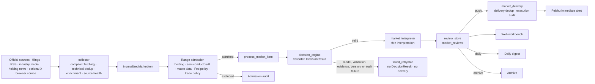

# MarketPulseWire

[简体中文](README.zh-CN.md) | English

[](https://github.com/Stayfoool/MarketPulseWire/actions/workflows/ci.yml)
[](https://github.com/Stayfoool/MarketPulseWire/releases)
[](https://www.python.org/)
[](LICENSE)

**A self-hosted AI market-information radar that turns scattered official sources, filings, RSS feeds, industry media, and holding-related news into validated immediate alerts, daily-digest items, or archives.**

MarketPulseWire is built for personal market and industry research, with a particular focus on semiconductors and AI infrastructure. It keeps credentials, portfolios, private decision rules, and runtime data on infrastructure you control, while providing Feishu delivery and a local Web workbench.

MarketPulseWire is not an investment adviser and does not generate buy/sell recommendations.

## Why MarketPulseWire

Important market signals rarely arrive through one clean feed. They are spread across company announcements, official blogs, exchange disclosures, regional supply-chain media, research summaries, fast-news services, and social sources. A keyword alert catches too much noise; an unconstrained LLM cannot be trusted to decide what should be pushed.

MarketPulseWire addresses both problems:

- **One information flow:** every admitted source becomes a `NormalizedMarketItem` and uses the same decision, storage, deduplication, delivery, and display path.
- **Evidence-validated decisions:** the LLM evaluates reviewed private rules and must return exact minimum source evidence for every `push` or `daily` result.
- **Fail-closed behavior:** model, schema, evidence, version, or private-audit failures create no valid `DecisionResult` and cannot enter delivery.
- **No source privilege:** a source name, category, or content type cannot create immediate-push eligibility.
- **Self-hosted operation:** credentials, portfolios, cookies, private rules, SQLite data, and sensitive decision audits stay outside Git.
- **Operational visibility:** the Web workbench exposes market information, decision results, source profiles, task health, source health, feedback, settings, and holdings management.

## Information Processing Flow

Every enabled source shares this structure. `DecisionResult.action` is the only authority for immediate-push eligibility.



The key correctness boundary is deliberately narrow:

1. A collector discovers and normalizes information, but cannot persist a completed review or send an item.
2. Range admission decides whether the content is in scope, but cannot assign an action.
3. `decision_engine` produces and strictly validates one `DecisionResult`.
4. `market_interpreter` adds only a short explanation and cannot change the action.
5. `review_store` persists the decision; `market_delivery` may block duplicates but cannot change it.
6. Only `push` reaches immediate Feishu delivery. `daily` waits for the digest, and `archive` remains searchable history.

For the complete current implementation, see [Architecture](docs/architecture-flow.md).

## Product Surfaces

### Web workbench

The loopback-only Web workbench provides:

- information center with source, action, status, date, and text filters;
- LLM decision review with rule results and retained audit metadata;
- current range-admission and decision-rule views;
- source profiles, source health, task health, and failure visibility;
- Feishu feedback metrics and examples;
- private settings, media keywords, and holdings management.

### Feishu delivery

Items with a valid `DecisionResult.action=push` can be sent as Feishu cards. Delivery records execution outcomes only; it cannot create or promote push eligibility. Optional signed feedback actions record whether a delivered item was especially useful, duplicated, or invalid.

## Built-In Source Radar

MarketPulseWire includes reusable collectors and source definitions for:

| Source group | Examples |
| --- | --- |
| Official company feeds | OpenAI, NVIDIA, Samsung Semiconductor, SK hynix, Micron |
| Official policy sources | U.S. Federal Register, USTR, European Commission, MOFCOM |
| Company disclosures | CNINFO announcements and investor-relations records |
| Industry and supply-chain media | TrendForce, SEMI releases, DIGITIMES, Nikkei xTECH, The Elec |
| China financial information | Sina Finance, First Yicai, CLS, Star Market Daily, WallstreetCN |
| Research summaries | AlphaAbstract and configured public/authorized research sources |
| Optional browser source | Logged-in X “Following” timeline through a private Chromium profile |

Source access is intentionally bounded. MarketPulseWire does not bypass paywalls, login walls, WAF challenges, or other access controls. See the [Source Catalog](docs/sources.md) for URLs, methods, and compliance notes.

## Quick Start: Open the Web Workbench

This starts a local empty workbench for evaluating the interface and configuration model. Python 3.10 or newer is required; CI runs on Python 3.11.

```bash
git clone https://github.com/Stayfoool/MarketPulseWire.git
cd MarketPulseWire
python3 -m venv .venv
. .venv/bin/activate
pip install -r requirements.txt
cp .env.example .env
cp config/portfolio.example.json config/portfolio.json
python scripts/market_db.py
python scripts/portfolio_import.py
python scripts/holdings_web.py --host 127.0.0.1 --port 8787
```

Open `http://127.0.0.1:8787`.

The workbench alone does not start collectors. Production monitoring requires reviewed private range-admission rules, reviewed private LLM decision rules, an OpenAI-compatible model, and configuration for only the sources you are authorized to use.

## Configure Monitoring

Copy `.env.example` to `.env` and fill only the capabilities you use. The preferred model configuration is:

```env
LLM_PROVIDER=openai_compatible
LLM_API_KEY=<your_api_key>
LLM_BASE_URL=https://api.example.com/v1
LLM_MODEL=your-model-name
LLM_TIMEOUT_SECONDS=90
LLM_RETRY_COUNT=2
```

Two separate private rule files are required for production collection:

- `RULE_CORE_CONFIG`: range admission, maintained outside Git;
- `LLM_DECISION_RULE_CONFIG`: reviewed `push` and `daily` conditions, maintained outside Git with mode `0600`.

The tracked files `config/rule_core_v1.test.json` and `config/llm_decision_rules.test.json` contain synthetic CI fixtures. They are not production configurations and must not be treated as recommended market rules.

Common model providers can be configured through their OpenAI-compatible endpoints. Only the `LLM_*` names are supported for the primary decision model.

## Deployment

The recommended always-on deployment is a Linux server with:

- Python 3.10+ and SQLite;
- systemd services and timers;
- the Web workbench bound to `127.0.0.1`;
- an SSH tunnel for operator access;
- private `.env`, rule files, browser profiles, reports, and SQLite owned by the service account.

MarketPulseWire also includes an optional manually triggered GitHub Actions SSH deployment workflow. GitHub deploys code; runtime secrets and private rules remain on the target server.

See [Deployment](docs/deployment.md) for the complete systemd, secret, browser, synchronization, log-retention, and production-verification procedures.

## Privacy and Security Boundaries

Do not commit or publish:

- real portfolios or watchlists;
- `.env`, API keys, Feishu secrets, cookies, or browser profiles;
- private range-admission or LLM decision rules;
- SQLite databases, logs, reports, private model audits, or paid content;
- raw private API responses or source material your access rights do not permit you to redistribute.

Sensitive LLM request/response audits are designed to remain in service-account-owned mode-`0600` files. Full model input, source bodies, and raw model responses do not enter Git, SQLite, the Web workbench, or Feishu.

Read [Security](docs/security.md) and [Compliance](docs/compliance.md) before enabling production sources.

## Development and Verification

The CI-safe regression list has one entry point:

```bash
python -m py_compile scripts/*.py
bash -n scripts/*.sh
python scripts/run_test_suite.py
python scripts/scan_secrets.py
```

Tests that use real credentials, send messages, upload media, or call production services remain operator smoke tests and do not run in ordinary CI.

Contributions are welcome for official source adapters, parser fixes, Web workbench improvements, model-output validation, failure handling, tests, and documentation. See [Contributing](CONTRIBUTING.md).

## Documentation

- [Current architecture](docs/architecture-flow.md)
- [Deployment and operations](docs/deployment.md)
- [Source catalog](docs/sources.md)
- [Security](docs/security.md)
- [Compliance](docs/compliance.md)
- [Changelog](CHANGELOG.md)

## License

[MIT](LICENSE)
