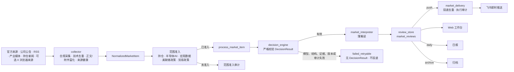

# MarketPulseWire

简体中文 | [English](README.md)

[](https://github.com/Stayfoool/MarketPulseWire/actions/workflows/ci.yml)
[](https://github.com/Stayfoool/MarketPulseWire/releases)
[](https://www.python.org/)
[](LICENSE)

**一个自托管的 AI 市场信息雷达：把分散的官方来源、公司公告、RSS、产业媒体和持仓相关新闻，整理成经过校验的即时推送、日报或归档。**

MarketPulseWire 面向个人市场与产业研究，重点覆盖半导体和 AI 基础设施。凭据、持仓、私有决策规则和运行数据保留在用户控制的基础设施中，结果通过飞书或本地 Web 工作台呈现。

MarketPulseWire 不提供投资建议，也不生成买入或卖出建议。

## 为什么做 MarketPulseWire

重要市场信息通常分散在公司公告、官方博客、交易所披露、区域产业链媒体、研究摘要、财经快讯和社交来源中。单纯关键词告警噪声太多；没有严格边界的大模型，也不应直接决定什么内容值得即时推送。

MarketPulseWire 同时解决这两个问题：

- **统一信息处理流程：**所有已准入来源最终都成为 `NormalizedMarketItem`，共用同一套决策、存储、去重、投递和展示流程。
- **原文证据校验：**大模型依据人工审定的私有规则判断，并为每个 `push` 或 `daily` 结果返回可逐字回验的最少原文证据。
- **关闭式失败：**模型、结构、证据、版本或私有审计失败时，不生成有效 `DecisionResult`，也不能进入投递。
- **来源没有推送特权：**来源名称、分类或内容形态不能创建即时推送资格。
- **自托管：**凭据、持仓、Cookie、私有规则、SQLite 和敏感决策审计不进入 Git。
- **运行状态可见：**Web 工作台统一展示市场信息、大模型决策、信息源、任务健康、来源健康、反馈、配置和持仓管理。

## 信息处理流程

所有启用的信息源共用下面的项目结构。`DecisionResult.action` 是即时推送资格的唯一权威。



正确性边界被刻意收紧：

1. collector 只发现、富化和标准化信息，不能写入已完成的 review，也不能自行发送消息。
2. 范围准入只判断内容是否属于当前研究范围，不能决定 action。
3. `decision_engine` 生成并严格校验唯一的 `DecisionResult`。
4. `market_interpreter` 只增加简短解读，不能修改 action。
5. `review_store` 保存决策；`market_delivery` 可以阻止重复发送，但不能修改决策。
6. 只有 `push` 能进入飞书即时推送；`daily` 等待日报，`archive` 保留为可查询历史。

完整实现说明见[当前架构](docs/architecture-flow.md)。

## 产品界面

### Web 工作台

仅绑定本机回环地址的 Web 工作台提供：

- 信息中心：按来源、action、状态、日期和正文筛选；
- 大模型决策：查看规则结果和保留的审计元数据；
- 当前范围准入和程度决策规则展示；
- 信息源、来源健康、任务健康和故障状态；
- 飞书反馈指标和示例；
- 私有配置、媒体关键词和持仓管理。

### 飞书投递

只有具备有效 `DecisionResult.action=push` 的信息才能发送飞书卡片。投递层只记录执行结果，不能创建或提升推送资格。可选的签名反馈按钮用于记录“特别有用”“重复”和“无效”。

## 内置信息源

MarketPulseWire 内置了以下可复用 collector 和来源定义：

| 来源组 | 示例 |
| --- | --- |
| 公司官方来源 | OpenAI、NVIDIA、Samsung Semiconductor、SK hynix、Micron |
| 官方政策来源 | 美国联邦公报、USTR、欧盟委员会、商务部 |
| 公司公告 | 巨潮资讯公告和投资者关系记录 |
| 产业与供应链媒体 | TrendForce、SEMI 新闻稿、DIGITIMES、Nikkei xTECH、The Elec |
| 中国财经信息 | 新浪财经、第一财经、财联社、科创板日报、华尔街见闻 |
| 研究摘要 | AlphaAbstract 和已配置的公开或获授权研究来源 |
| 可选浏览器来源 | 通过服务器私有 Chromium profile 读取已登录 X“正在关注”时间线 |

所有来源都遵守有界访问原则。MarketPulseWire 不绕过付费墙、登录墙、WAF 挑战或其他访问控制。具体地址、方式和合规边界见[来源目录](docs/sources.md)。

## 快速开始：打开 Web 工作台

下面的步骤会创建一个本机空数据库并启动 Web 工作台，用于了解界面和配置模型。需要 Python 3.10 或更高版本；CI 使用 Python 3.11。

```bash
git clone https://github.com/Stayfoool/MarketPulseWire.git
cd MarketPulseWire
python3 -m venv .venv
. .venv/bin/activate
pip install -r requirements.txt
cp .env.example .env
cp config/portfolio.example.json config/portfolio.json
python scripts/market_db.py
python scripts/portfolio_import.py
python scripts/holdings_web.py --host 127.0.0.1 --port 8787
```

打开 `http://127.0.0.1:8787`。

启动 Web 工作台不会自动启动 collector。生产监控还需要人工审定的私有范围准入规则、人工审定的私有大模型程度决策规则、OpenAI-compatible 模型，以及用户有权使用的信息源配置。

## 配置生产监控

把 `.env.example` 复制为 `.env`，只填写实际使用的能力。推荐的大模型配置为：

```env
LLM_PROVIDER=deepseek
LLM_API_KEY=<your_deepseek_api_key>
LLM_BASE_URL=https://api.deepseek.com
LLM_MODEL=deepseek-chat
LLM_GLM_API_KEY=<your_zhipu_api_key>
LLM_TIMEOUT_SECONDS=90
LLM_RETRY_COUNT=2
```

配置中心的“当前模型”可在 DeepSeek 与智谱 GLM 5.3 Flash 之间一键切换。智谱连接固定使用官方 `https://open.bigmodel.cn/api/paas/v4` 和 `glm-5.3-flash`；两个 API Key 都只保存在 mode `0600` 的私有 `.env`，不会回显明文。既有 `LLM_PROVIDER=openai_compatible` 配置继续使用 `LLM_API_KEY`、`LLM_BASE_URL` 和 `LLM_MODEL`。

生产 collector 需要两份相互独立的私有规则文件：

- `RULE_CORE_CONFIG`：范围准入规则，保存在 Git 之外；
- `LLM_DECISION_RULE_CONFIG`：人工审定的 `push` 和 `daily` 条件，保存在 Git 之外并设置 mode `0600`。

仓库中的 `config/rule_core_v1.test.json` 和 `config/llm_decision_rules.test.json` 只包含虚构 CI 测试配置，不是生产配置，也不代表推荐的市场判断规则。

主程度决策模型只支持 `LLM_*` 配置名称；DeepSeek、智谱 GLM 5.3 Flash 和既有兼容模型共用同一 OpenAI-compatible 调用链。

## 部署

推荐的持续运行环境为 Linux 服务器：

- Python 3.10+ 和 SQLite；
- systemd services 和 timers；
- Web 工作台绑定 `127.0.0.1`；
- 操作员通过 SSH tunnel 访问；
- `.env`、私有规则、browser profile、报告和 SQLite 由生产服务账号私有持有。

仓库同时提供可选的 GitHub Actions SSH 手动部署工作流。GitHub 只部署代码，运行凭据和私有规则继续保存在目标服务器。

完整 systemd、凭据、浏览器、同步、日志保留和生产验证步骤见[部署文档](docs/deployment.md)。

## 隐私和安全边界

不要提交或公开：

- 真实持仓和关注名单；
- `.env`、API Key、飞书密钥、Cookie 和 browser profile；
- 私有范围准入规则和私有大模型程度决策规则；
- SQLite、日志、报告、私有大模型审计或付费内容；
- 无权再分发的私有 API 响应或来源正文。

敏感的大模型实际请求和原始回答只保存在生产服务账号私有、mode `0600` 的审计文件中。完整模型输入、来源正文和原始回答不进入 Git、SQLite、Web 工作台或飞书。

启用生产来源前请阅读[安全说明](docs/security.md)和[合规说明](docs/compliance.md)。

## 开发和验证

CI-safe 回归只有一个清单入口：

```bash
python -m py_compile scripts/*.py
bash -n scripts/*.sh
python scripts/run_test_suite.py
python scripts/scan_secrets.py
```

使用真实凭据、发送消息、上传媒体或调用生产服务的测试属于 operator smoke，不进入普通 CI。

欢迎贡献官方来源 adapter、解析修复、Web 工作台改进、大模型输出校验、失败处理、测试和文档。具体要求见[贡献说明](CONTRIBUTING.md)。

## 文档

- [当前架构](docs/architecture-flow.md)
- [部署与运维](docs/deployment.md)
- [来源目录](docs/sources.md)
- [安全说明](docs/security.md)
- [合规说明](docs/compliance.md)
- [版本记录](CHANGELOG.md)

## 开源许可证

[MIT](LICENSE)
