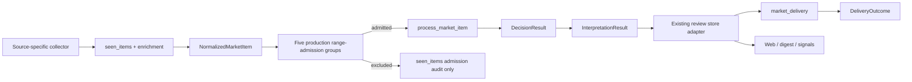

# MarketPulseWire Current Architecture

This document is an as-built map of the current code and production shape. Engineering rules live in `AGENTS.md`; active work lives in the local `docs/monitoring-plan.md`; deployment operations live in `docs/deployment.md`.

## Runtime Spine

All general research, industry-media, news-media, official-company, official trade-policy, flash, portfolio-news, company-disclosure, AlphaAbstract, and ValueList items use one runtime entry:

```text
collector
-> seen_items discovery/dedup reservation (article/flash sources)
-> detail/RSS body/summary/PDF/OCR enrichment and technical validity
-> NormalizedMarketItem
-> five production range-admission groups
-> process_market_item
-> decision_engine
-> market_interpreter
-> review store adapter
-> market_delivery
-> Web / digest / Feishu
```



`DecisionResult.action` is the only push-eligibility input accepted by delivery. Delivery execution may still produce `sent`, `duplicate`, `skipped`, or `failed`. Missing decisions cannot fall back to legacy push fields. For a push-eligible intraday Chinese equity market move, delivery may derive a conservative source-neutral fact identity from the Beijing market date, direction, literal concept, and an already matched holding/keyword target; the first reservation sends and later matching source retransmissions are recorded as duplicates without changing the decision.

The production range admission is the logical OR of `holding`,
`semiconductor_ai`, `macro_data`, `fed_policy`, and `trade_policy`. Ordinary
article, research, official-company and Sina 7x24 items may enter through any
group. Company disclosures and Sina stock news are holding-only sources.
Official trade-policy profiles receive direct `trade_policy` admission after
normalization. An excluded article/flash remains in `seen_items` with the exact
`AdmissionResult` audit and creates no decision, interpretation, review, dedup
reservation or delivery. Baseline rows remain non-deliverable and are not
reprocessed because of this switch.

Production admission reads the complete private rule file selected by
`RULE_CORE_CONFIG` and current enabled holdings, aliases, related-news keywords
and exclusions from the Web-managed production SQLite. `RULE_CORE_SHADOW_PORTFOLIO`
is not a production input. Missing or invalid production rule configuration
fails closed and leaves a retryable processing state; it does not fall back to
the preceding source-specific admission.

Before an admitted item that requires analysis enters the active decision, `market_runtime.py` calls the existing `prepare_item_for_decision()` at most once. The returned `NormalizedMarketItem`, including any validated `_attributed_research` extraction, is then reused by the active decision/store adapter and the optional report-only LLM strength comparison. The comparison receives the exact production `AdmissionResult` and production portfolio used for admission; it does not re-admit the item from `RULE_CORE_SHADOW_PORTFOLIO`. Baseline and already-existing event rows do not trigger this preparation. The comparison report may retain normalized institution ids but removes attribution quotes, claim quotes and body text.

Pure, source-neutral statements of an established Federal Reserve policy-transmission relationship, such as easing benefiting gold, Bitcoin, non-US currencies or metals, are deterministically downgraded from `push` to `daily` after the macro rule. This downgrade applies only when the item contains no actual policy decision, quantified rate-path repricing, quantified observed asset move, unusual inverse relationship, correction, direct Fed statement or asset-specific hard fact. It retains the original rule hit and records the initial/final action plus local evidence in the decision audit; it cannot promote a non-push action.

Push-eligible US CPI, PCE and nonfarm coverage may also receive a delivery-only identity from locally bound evidence. Preview and actual-release identities use country, indicator and reference period. The extractor considers every indicator occurrence in a claim before binding the nearest preceding reference month, so an early generic `CPI` label cannot hide a later locally complete `6月...CPI月率` fact. Market reactions use the same reference period, conservatively inferring the immediately preceding month when a reaction names the indicator but omits the period, so cross-asset and next-day retellings converge. Each phase can deliver once across sources. Corrections, policy decisions, quantified path repricing, unusual inverse relationships, asset-specific hard facts and direct Kevin Warsh statements bypass the reaction identity, including when a retained fact is mixed with already-covered market interpretation. Other cross-asset reactions to a Fed easing or tightening impulse without a named data release share one direction-specific 14-day delivery identity. The extractors use original item text and deterministic evidence only; delivery dedup does not change the decision or use an LLM.

Push-eligible industry-hardline coverage may receive a bounded 36-hour delivery-only fact identity when original text deterministically supplies subject, event, stage, object and direction. The initial event families cover IBM enterprise spending shifting toward memory hardware and CoreWeave exploring derivatives to hedge storage-chip price downside. Cross-source rewrites remain push decisions but are recorded as duplicates. Corrections, company confirmation or denial, execution-stage changes, material derivative terms and independently attributable HBM/DRAM/NAND supplier production facts bypass the prior identity.

Push-eligible holding or industry-hardline coverage may also receive source-neutral company-event delivery identities. Claim-local stock codes, direct holding entities and validated company-name/action grammar resolve explicit subjects without an issuer allowlist. Common company actions use strict structured slots, while the conservative generic path requires an explicit subject, action family, reference/effective time and distinctive counterparty, object or quantitative anchor. Each item may produce a fact set rather than one selected key. The delivery layer reserves every new identity in one immediate SQLite transaction, suppresses only when the entire set is already covered, confirms all reservations after send success and releases all after failure. Stable event identity is separated from lifecycle/material version so equivalent or subset restatements deduplicate while explicit corrections, revisions, approvals, completions and terminations remain deliverable. The predecessor's five bounded keys remain only as migration aliases. These execution records preserve the original `DecisionResult.action=push`.

The former direct/compat route switch and these wrapper modules have been removed:

- `article_gate.py`
- `official_news_gate.py`
- `content_runtime.py`
- `event_runtime.py`
- `market_content_flow.py`
- `market_event_flow.py`
- `event_pipeline.py`

## Module Ownership

| Module | Current responsibility |
|---|---|
| `market_runtime.py` | Normalization boundary, one-time pre-decision evidence preparation, store adapter selection, orchestration, fail-closed contract handling, and the exact production `AdmissionResult` passed to the report-only comparison |
| `decision_engine.py` | Deterministic `DecisionResult`, including final push action |
| `production_admission.py` | Sole production entry for the five range-admission groups; validates `RULE_CORE_CONFIG`, converts current Web-managed SQLite holdings to `PortfolioRuleConfig`, applies ordinary/holding-only/official-trade source boundaries and returns the auditable `AdmissionResult`; it cannot decide action, write reviews or deliver |
| `rule_core_v1.py` | Side-effect-free five-group admission and inactive deterministic strength rules. Production calls only `admit_market_item()` through `production_admission.py`; `evaluate_market_item()` remains non-authoritative. Bounded admission evidence includes all matched content-family evidence and global exclusion evidence |
| `llm_rule_catalog.py` | Versioned catalog of the 22 human-reviewed strength-decision rules across the five existing content rule groups; stores allowed actions, rule text, required facts and exclusions without matching article text, reading private configuration or calling a model |
| `llm_rule_decision.py` | Report-only LLM decision contract: applies the confirmed company-disclosure/Sina-stock-news holding-only source boundary, selects rules only from an existing admitted `AdmissionResult`, accepts title/summary/body inputs with body code-bounded to its first 3,000 characters, divides the exact model-visible article fields into numbered source segments, and strictly validates compact per-rule JSON, allowed actions and source-segment references before code resolves exact evidence and mechanically aggregates the final action. Each rule may reference at most three segments and all rules together at most eight. It has no review, storage, delivery or dedup authority |
| `llm_rule_shadow.py` | Optional report-only LLM candidate: evaluates the same prepared production `NormalizedMarketItem`, calls the configured text model for an admitted item, validates the response through `llm_rule_decision.py`, and returns a bounded comparison candidate. Any structurally invalid, evidence-invalid or conflicting first response may receive one bounded correction request containing the exact validation errors without changing rules, article evidence or admission. Every attempted request, raw response and validation result is attached only to the private per-item audit; model failure or a still-invalid correction produces no candidate action |
| `investment_bank_research.py` | Side-effect-free local extraction shared by the active investment-bank rating wrapper and the report-only candidate: trusted institution, holding/industry subject, rating/target-price/coverage action, allocation action or complete rotation, and verbatim evidence; it does not read Rule Center, SQLite, source profiles or deliver messages |
| `rule_core_fixture.py` | Strict loader for the sanitized public v1 behavior corpus; test/spec support only |
| `market_lifecycle_v1.py` | Inactive lifecycle/source-integration contract, bounded discovery shape, legal transitions and honest read-only projections over the current article/event physical stores |
| `rule_config_migration_v1.py` | Inactive redacted preview of explicitly supplied legacy keyword origins versus a reviewed v1 target configuration; never writes configuration or prints keyword values |
| `rule_core_replay.py` | Inactive no-write comparison of explicit current outcome snapshots against the pure v1 core, including changed fields and source-invariance violations |
| `rule_core_history_replay.py` | Inactive operator-only reader for an explicit local SQLite snapshot; strict mode requires stored full text and uses `mode=ro`/`query_only`, while optional title/summary proxy screening is explicitly non-comparative; delegates comparison to `rule_core_replay.py` |
| `rule_core_shadow.py` | Side-effect-free comparison of the active `DecisionResult` with `rule_core_v1` for the same normalized item; records only bounded differences and cannot change review or delivery |
| `rule_core_runtime_shadow.py` | Optional report-only strength-decision writer using the same admitted production `NormalizedMarketItem`, exact production `AdmissionResult`, and current production portfolio. `RULE_COMPARISON_CANDIDATE=llm` selects the reviewed LLM candidate. It records comparison time, candidate engine/version, private configuration version and deployed code revision, writes sensitive per-item audits mode `0600`, and cannot write reviews, reserve delivery keys or send messages |
| `rule_core_shadow_combined.py` | Report-only combiner for existing comparison reports; separates action comparisons, both-not-admitted items, admission differences and model/validation failures; preserves candidate engine/version, bounded resolved rule evidence, body-source label, model metadata, token usage and elapsed time; and refreshes one latest Markdown/JSON view across research, official and news production batches. Combined reports never copy the private model request, article body or raw response, and non-action-comparison rows are not counted as action upgrades or downgrades |
| `rule_core_shadow_daily.py` | Report-only daily review job; removes sensitive model request/response payloads from private per-item audits after 30 days while retaining bounded comparison metadata, freezes one 15:30-to-15:30 Beijing Markdown/JSON report, and sends at most one Feishu reminder when the interval has comparable or unable-to-compare items. Daily reports never copy private model requests, article bodies or raw responses. An explicit historical rebuild only re-aggregates retained comparisons, records that the candidate was not re-evaluated and preserves any prior sent reminder |
| `rule_shadow_report_store.py` | Bounded read-only loader for dated rule comparison reports used by the authenticated Web workbench; each Web filter accepts multiple selected values, values inside one filter use OR, and candidate-version, execution-status, action-change and current/candidate-action filters combine with AND in memory. The loader cannot evaluate rules or send messages |
| `rule_core_shadow_report.py` | Inactive operator-only reader for a shadow collector JSON report; supplies complete retained item text to `rule_core_shadow.py` and writes only a bounded comparison report |
| `run_production_with_rule_shadow.py` | Production service entry wrapper; runs the existing collector once and, when comparison is enabled, refreshes the combined report after runtime comparison files have been written; it does not start a second collector or evaluate rules |
| `ai_credit_risk.py` | Source-neutral deterministic AI borrower, funding-event and qualitative credit-stress evidence classification |
| `ai_compute_supply_demand.py` | Source-neutral deterministic AI compute supply, demand, capacity and constraint classification |
| `macro_policy.py` | Source-neutral macro-data release/reaction and generic Fed policy-transmission evidence classification; production wrappers read Rule Center lazily and preserve the active production decision contract |
| `trade_friction.py` | Source-neutral China-US / China-EU trade-friction classification and evidence extraction |
| `trade_policy_monitor.py` | Official API/RSS/list discovery, new-item detail enrichment, baseline and source health |
| `company_disclosures.py` | One logical portfolio-disclosure collector, provider selection, baseline, source state and health |
| `disclosure_providers.py` / `cninfo_disclosure_provider.py` | Provider-neutral disclosure contract and CNINFO public-query transport |
| `disclosure_document.py` | Shared bounded PDF download, SHA-256 and `pypdf` text extraction |
| `market_interpreter.py` | Thin interpretation and bounded LLM output normalization |
| `market_content_adapter.py` | Article and official-news compatibility payload/store shape |
| `market_event_adapter.py` | Event compatibility payload/store shape |
| `market_review_store.py` | SQLite review/event persistence and historical row loading |
| `market_delivery.py` | Rule/fact dedup reservation, Feishu execution, delivery status, pushed markers |
| `market_feedback.py` | Cross-source append-only human feedback, signed item identity, last-click-wins projection and quality aggregates |
| `feishu_app.py` / `feishu_feedback_service.py` | Feedback-enabled application-bot send and official long-connection card callbacks |
| `macro_event_dedup.py` | Delivery-only US macro preview/release/reaction and Fed policy cross-asset reaction identities, including mixed-Warsh handling |
| `industry_fact_dedup.py` | Bounded delivery-only industry fact identities and material-update exclusions |
| `company_event_dedup.py` | Generic claim-local company-event fact sets, lifecycle versions and legacy reservation aliases |
| `market_view.py` | Read-only unified projection across existing stores |
| `source_profiles.py` | Source catalog, runtime ownership, health keys and editable source settings |
| `rule_config_schema.py` | Side-effect-free parser shared by the report-only rule core and the production Web/config path; validates the complete private global rule JSON without importing candidate decision behavior into production collectors |
| `media_keyword_config.py` | Shared loader and atomic Web save path for the private rule configuration's `semiconductor_ai_keywords` and `exclude_keywords`; validates the complete rule file and preserves every unrelated rule section |
| `migrate_media_keywords.py` | Operator-only preview/apply migration from the retired private base/include media-keyword fields into the reviewed `semiconductor_ai_keywords`; preview redacts values and apply creates a private backup |

## Production Sources

| Source group | Production entry | Item processing |
|---|---|---|
| Research and industry media | `research_collector.py` -> `rss_monitor.py` / `trendforce_page_monitor.py` / `alphabstract_monitor.py` | Unified runtime, article store |
| Official company feeds | `official_collector.py` -> `rss_monitor.py` | Unified runtime, official-news store |
| Domestic and overseas news media | `news_collector.py` -> `china_finance_media_monitor.py` / `wallstreetcn_monitor.py` / RSS helpers | Sina, Yicai, CLS, Jin10 and WallstreetCN public article/flash discovery; unified runtime, article store |
| Official trade policy | `news_collector.py` -> `trade_policy_monitor.py` | Federal Register, USTR, European Commission and MOFCOM public sources; reserve `seen_items` before optional detail enrichment, then unified runtime and article store |
| Sina 7x24 flash | `sina_flash.py` | Reserve every discovered flash in `seen_items`; five-group-admitted flashes continue through the unified runtime into the event store |
| Sina portfolio stock news | `sina_stock_news.py` | Relevance enrichment, then unified runtime and event store |
| Company disclosures | `company_disclosures.py` -> `cninfo_disclosure_provider.py` | Twice daily CNINFO fulltext/relation discovery and official-PDF enrichment; report-only writes baseline event audits, while live mode enables analysis and delivery |
| AlphaAbstract research summaries | `alphabstract_monitor.py` through `research_collector.py` | Public sitemap discovery reserves `seen_items` identity before public-summary page enrichment, then unified runtime and article store |
| ValueList research directory | `value_directory_monitor.py` | One private-browser session collects all enabled lists and visible first-page preview metadata, then closes before OCR and unified runtime/article-store processing |

Source-specific login, WAF, API, sitemap discovery, polling, browser profile, OCR and attachment behavior ends before the normalized runtime boundary.

Each ValueList timer run uses one persistent Chromium context for all enabled ValueList sources. It reads both list pages and the visible first-page preview metadata for their bounded entries before closing the context once. Only after profile release succeeds does the monitor run OCR, normalization, the current decision, storage and delivery. There is no preliminary strength-decision gate before preview/OCR; every production-visible item can contribute its available preview evidence to the one normalized decision. A list failure remains attributed to that source while another successfully collected source may continue; a detail-preview failure remains attached to that item and follows the existing preview-failure policy. A browser launch or shutdown failure stops post-browser processing for every source owned by that session, so no later phase can silently relaunch Chromium against the same private profile.

Domestic finance media reserve each technically identifiable live discovery in
`seen_items` before detail enrichment, then record processability and construct
one `NormalizedMarketItem`. The five production range-admission groups inspect
its title, summary, full text and structured symbols. Admitted items continue
through the existing decision/review/delivery path; excluded items retain only
their `seen_items` admission audit. Rediscovered items whose processability,
admission evaluation or processing remains `pending`/`failed_retryable` are
eligible for retry without deleting their discovery reservation.

The same lifecycle now covers the widened overseas/industry RSS, TrendForce
page and official-company RSS paths. Their source-specific discovery controls
(feed/page selection, URL/schema validation and access policy) remain before
the reservation, but the business media-focus filter no longer blocks
`seen_items`. Each source group records an `expanded_scope_baseline_at`
watermark in its source state; rows first exposed by that widened scope are
baseline-only and cannot be delivered retroactively. Later live rows reuse the
same processability, admission and processing states, including retryable
failures. AlphaAbstract uses the same ordering around its public-summary page.
These sources persist the same five-group `AdmissionResult` before the existing
strength decision.

Official trade-policy sources also reserve their stable list identity in
`seen_items` before optional detail enrichment. A detail failure retains the
official list evidence and records the fallback. After normalization the official
trade-policy profile receives direct production `trade_policy` admission and
continues to the existing strength decision.

Sina 7x24 uses `seen_items` for discovery identity, baseline, retry and production
admission audit. The first non-empty response after this ordering change is an
expanded-scope baseline and creates no event or delivery. Later rows are
normalized from the provider's complete flash text. The five production
range-admission groups are evaluated there: excluded rows remain in `seen_items`,
while admitted rows proceed to `events` / `event_analyses`. Existing
Sina 7x24 events are projected into `seen_items` as historical identities, and an
admitted row stores its resulting event id. Event Center suppresses the matching
`seen_items` projection whenever the event exists, so one flash is displayed
once. A retry can complete an existing event that has no analysis.

Synchronous HTTP connection pools are isolated per worker thread. A source retry or timeout-key change may close only that thread's client; concurrent collectors cannot close another thread's in-flight TLS connection or leave a stale network writer targeting a reused SQLite file descriptor.

Ordinary bounded collector/provider requests use the shared `http_utils` transport. This includes CNINFO's form-encoded JSON lookup and disclosure-list POSTs, whose provider adapter retains only its required headers, form shape, response validation and `CninfoError` contract. Direct `urllib.request` runtime use is closed by an architecture-invariant registry: current entries are bounded streaming/binary transfers, the X long-lived stream, provider-specialized LLM/Feishu behavior, explicitly tracked legacy request paths and standalone operator tools. The shared buffered response helper is not used for disclosure PDFs because their downloader enforces a byte ceiling while streaming to an atomic temporary file.

Company disclosures use the logical source `company_disclosures`. `transport_provider` remains raw audit metadata and cannot affect importance or action. The current fixed provider factory contains `cninfo_public`; a future provider implements the same security-resolution and paginated-list contract and is selected through the private source profile. CNINFO `orgId` mappings, provider baselines and provider-neutral known identities use the existing `source_state`. Fulltext announcements and `relation/category_dyhd_szdy` investor-relations records are queried separately, then normalized identically. A provider's first successful run and every `report_only` discovery enter the unified event runtime only as `baseline_only` audits with analysis and delivery disabled. They remain visible behind Event Center's baseline filter but cannot create a decision, AI interpretation or notification. Historical `ifind_notice` event rows remain readable compatibility data; the expired iFinD announcement timer is removed.

CLS telegraph collection preserves bounded official product metadata in the normalized raw audit: numeric `type`, the official bracketed product label, `share_img`/VIP status, and parsed `author_extends` stock names/codes. Article cards display these fields for an observation phase approved by the user. The metadata does not enter deterministic rule matching, importance or `DecisionResult.action`; the existing public `content` remains the decision text.

The `trade_friction_escalation` rule is not tied to the official source group. It runs in `decision_engine.py` for every normalized current or future source. Explicit policy procedures, instruments, retaliation or worsening China-US / China-EU relations can produce `push`; weaker explicit tension can produce `daily`; routine administrative reviews and generic diplomacy do not receive an alert action.

The authenticated Web `媒体关键词` page and every existing media-focus consumer
read the same `semiconductor_ai_keywords` and `exclude_keywords` fields from the
private rule file selected by `RULE_CORE_CONFIG`. The Web save path
validates the complete rule file, changes only those two fields, preserves all
other rule groups, writes atomically with mode `0600` and creates a private
backup. Retired code-default, base and extra-include lists have no runtime
precedence or fallback. Their old private file is read only by the explicit
one-time migration command documented in `docs/deployment.md`.

The `international_bank_fed_rate_path_revision` rule is also source-neutral. It requires local attributed evidence that an audited major international bank changed its expected Federal Reserve hike/cut direction, count, timing, cumulative basis points or terminal rate. Material revisions produce `push`; a concrete current forecast without a provable revision produces `daily`. WallstreetCN identity and category metadata cannot create eligibility. Same-report reposts use the existing `rule_alert_dedup` reservation, while a later genuine path revision remains eligible.

Attributed-research delivery identities normally use the validated institution, topic, event family and locally retained horizon. The feedback-confirmed SEMI 2026 equipment-sales forecast uses a bounded canonical report identity anchored by institution, equipment-sales subject, 2026 horizon and normalized USD 165.9 billion metric; Chinese and English rewrites converge while each rewrite carries its prior generic hash as a migration alias. Other SEMI reports continue using the generic attributed-research identity.

The ordered `investment_bank_rating_target_direct_holding` rule requires one local evidence window to bind a recognized institution, one directly mentioned holding and an actual rating, target-price or coverage action. An attached collector symbol, a generic earnings-estimate revision or institution/holding/action terms scattered across a multi-company article cannot create this rule hit. Bounded adjacent-sentence attribution is accepted only when the second sentence explicitly continues with `该行` / `其` / `the bank` or an equivalent report reference.

The report-only new rule core applies trusted-institution rating, target-price and coverage changes only to the holding rule family. It applies explicit buy/sell/long/short/add/reduce/overweight/underweight allocation changes and complete two-sided rotations only to the holding and semiconductor/AI rule families. Macro-data releases, international-bank Fed-path forecasts/revisions and trade-policy changes continue through their dedicated content rules; an allocation verb plus a macro/Fed/trade term cannot promote those families or replace their evidence requirements.

For a Value Directory first-page preview, the existing bounded extraction now
also exposes an explicitly labeled historical share-price close and its date as
`reference_price` and `reference_price_date`; it does not expose the full OCR
page to the strength-decision model. The existing report-only
`holding_rating_revision` and `investment_bank_allocation_change` rules let the
model calculate `target price / report historical close - 1` and select the
action from the unrounded result. A result at least 30.0% or at most -30.0% may
select `push`; 17.6% and 29.9% remain ordinary unless another reviewed
condition independently matches. A current target price alone is not a new
long/short, allocation or target-revision action. The evidence must identify
the trusted institution, stock, current target price, historical close and
close date. Ambiguous labels, prior or consensus targets, 52-week ranges,
external live prices, mismatched currencies or share classes, unclear corporate
actions, and a material rating/direction conflict require `uncertain`. The
shared LLM system prompt is unchanged, no deterministic target-gap calculator
is added, and this result remains a report-only candidate without production
delivery authority.

Within the same report-only `fed_policy` decision group, a separately reported material view from a configured trusted international bank's explicitly identified chief executive or chair can use the existing `fed_policy_material_exception`. It requires local leader attribution and at least two independently supported signals across an explicit stocks/long-Treasuries stance, a directional or quantified rate/yield view, and a material cross-asset risk judgment. A bank name, analyst comment, generic leadership interview or single-asset valuation view cannot create `push`; the active production international-bank/Fed wrappers are unchanged.

The Rule Center exposes execution semantics from the runtime registry. Rules inside `first_matching_push_rule()` use `ordered_first_match` and retain an editable priority. Fed-path, trade-friction, attributed-research, industry-hardline and AI credit-risk rules are evaluated independently in `decision_engine`, use `parallel_merge`, and expose no priority setting; multiple push-eligible hits are combined rather than suppressing one another.

The `ai_hyperscaler_credit_stress` rule is source-neutral and uses deterministic local evidence only. It covers Alphabet/Google, Amazon/AWS, Meta, Microsoft, Oracle, NVIDIA, SpaceX and OpenAI when AI infrastructure purpose and debt context are locally bound. Ordinary issuance and one qualitative concern produce `daily`; an explicit financing/capex/rating/liquidity hard outcome, or at least two independent stress families including a concrete market outcome, can produce `push`. The rule uses no LLM extraction, external bond feed or numeric spread/leverage threshold. Generic financing no longer counts as an industry-hardline capex/investment event by itself.

The report-only new rule invocation additionally treats a formally maintained regulatory guarantee, collateral or letter-of-credit requirement and a locally bound AI-infrastructure credit-rating downgrade as hard funding outcomes. Possible or unconfirmed future requirements and background contract/investment amounts do not qualify. The shared classifier keeps this extension off by default so the active production wrapper retains its existing behavior until the new rule core is approved for authority.

The `ai_compute_supply_demand` rule is a source-neutral deterministic `parallel_merge` rule. It binds subject, compute resource, event, direction, stage and verbatim evidence. Generic confidence, forecasts, non-binding intentions, downstream demand and unbound price moves remain `daily` or unmatched. Its catalyst identity uses the existing atomic `rule_alert_dedup` path.

## Storage

New production items also use the canonical storage contract:

- `market_items` owns one `(source, source_item_id)` identity, collected title,
  summary and available full text, source metadata, baseline/live class and the
  technical processing lifecycle. `seen_items` inserts and lifecycle updates
  are projected into this table before normalization; the normalized item then
  fills the richer content and metadata on the same row.
- `market_reviews` stores a versioned production `AdmissionResult` for every
  normalized live item. An excluded row has no `DecisionResult` or
  `InterpretationResult`. An admitted row is completed with the exact results
  returned by the unified runtime before delivery. It also retains the bounded
  compatibility payload needed to reproduce existing Web, digest, feedback and
  signal views; private report-only LLM requests/responses remain outside
  SQLite.
- `market_item_aliases` maps the unified item identity to the existing
  `article`, `official` and numeric `event` identities. Feishu feedback tokens,
  signal source ids and Web links therefore remain valid during the storage
  transition.
- `deliveries` remains an execution audit, independent from decision
  authority. Additive `market_item_id`, `market_review_id`, `decision_action`
  and `attempted_at` columns link article, official-news and event delivery
  outcomes to the same item/review contract.

The first deployment backfills historical `seen_items` identities. The second
additive migration, run explicitly with `market_storage_migration.py --apply`
after a preview and SQLite backup, copies historical article/official results,
every event-analysis version and every event identity into the unified tables.
Only a valid stored `DecisionResult` is copied as an action; legacy push flags,
importance and delivery history cannot create an action. Missing body text,
admission evidence and decisions remain missing and are labelled
`legacy_unclassified`.

After the second migration marker exists, Web Event Center, article/official
daily output, feedback lookup/quality metrics and signal extraction read the
unified tables through `market_canonical_reader.py`. When an event has multiple
current task results, display and signal readers use the latest result while all
versions remain stored. Existing external ids are resolved through
`market_item_aliases`; historical deliveries without a provable originating
review link only to the item. Legacy writes and tables remain enabled for
rollback in this stage, but readers do not use them as decision authority.

The project keeps the existing physical stores:

- `article_reviews`
- `official_news_reviews`
- `events` / `event_analyses`
- `seen_items`, `seen_posts`, `source_state`
- `rule_alert_dedup`, `deliveries` (`rule_alert_dedup` also records delivery-only intraday market-move, US macro event, bounded industry-fact and generic company-event fact-set reservations)
- `market_feedback` (append-only Feishu feedback events; the latest valid operator/item click is the current projection)
- `source_health`, `x_stream_health`
- portfolio, relation, evidence and signal tables

`article`, `official` and `event` are compatibility storage/audit identities,
not decision-pipeline identities. All three arrive through the unified runtime
above. `article_reviews`, `official_news_reviews`, and `events` /
`event_analyses` remain compatibility writes for rollback after the unified
read switch. Removing those writes or tables requires a separate production
observation period, explicit approval and another migration.

`seen_items` keeps discovery identity as its primary responsibility. Additive
compatibility columns record `collection_class`, processability, admission and
processing status for newly collected domestic finance-media, RSS, TrendForce,
AlphaAbstract, ValueList, official trade-policy and Sina 7x24 items. Admission
audit fields retain matched groups, bounded evidence, configuration version,
rule-contract version and evaluation time; Sina 7x24 may additionally retain the
resulting event id. Existing rows are migrated as `legacy_unclassified`; no
historical baseline/exclusion/failure state is inferred, except that existing
Sina 7x24 event identities are explicitly projected as already admitted legacy
events. `DecisionResult.action` and delivery status are not copied into this
ledger and remain authoritative in the existing review/delivery paths.

AlphaAbstract reads its public sitemap into bounded discovery records containing
the stable summary URL identity and sitemap timestamp, then reserves those
records in `seen_items` before requesting the public summary page. The first
non-empty sitemap response after this ordering change records a per-source
`expanded_scope_baseline_at` boundary; already-visible rows are baseline and do
not enter enrichment, decision, review or delivery. Later live rows fetch and
parse the public summary page, update only the bounded title/summary/date fields
in `seen_items`, form `NormalizedMarketItem`, and enter the shared runtime. The
article body remains outside `seen_items`. Detail/parse failures and downstream
processing failures remain retryable when the same sitemap identity is observed
again; completed and baseline rows are not retried. The research collector's
read-only report path may still perform complete public-page enrichment without
writing discovery or lifecycle state.

`push_now`, `should_push_now` and `should_push` remain compatibility columns for historical readers and old rows. New delivery code does not read them as action inputs. `pushed_at` and delivery rows record what happened, not what should be sent.

When Feishu market feedback is explicitly enabled, unified article, official-news and event cards are sent by the configured enterprise application bot and carry signed `特别有用` / `重复` / `无效` actions. The delivery audit retains the feedback-card base payload for cards sent after this feature is enabled. After a valid action, the official long-connection callback appends only to `market_feedback` and returns a replacement of that same Feishu card with `反馈状态` and a `✓` on the current label; clicking that selected label again appends a superseding `cleared` event and restores the unselected card instead of deleting history. It cannot modify decisions, delivery reservations, source settings or rule settings. Legacy cards without a retained base payload keep their Toast acknowledgement rather than receiving a lossy replacement. `FEISHU_FEEDBACK_LISTENER_ENABLED` may start that listener for an isolated test card while leaving natural unified delivery on the pre-existing custom webhook. Test-card rows and current `cleared` states are excluded from quality denominators and Event Center feedback projection. Current feedback is selected by Feishu action time, then insertion id, so delayed callbacks cannot overwrite or cancel a newer choice. The Web workbench exposes feedback coverage and observed labelled-card outcomes by source, primary rule, all rule associations and source-by-primary-rule. Its Event Center also reads the same current projection through `item_kind + source + item_id`, showing feedback on the three active store adapters and filtering inside each store query before limits. This projection is read-only, excludes test cards and operator identities, and distinguishes delivered-but-unlabelled, not-delivered and unsupported-route rows.

The Web workbench exposes a lightweight authenticated `/api/health/summary` projection for separate Task Health and Information Sources badges. One batched read-only `systemctl show` call pairs each production timer with its execution service; `task_failures` counts current logical-task failures, while `source_failures` counts only failing enabled profiles that are visible in the Information Sources view. Shadow units, cut-over legacy units, the disabled-by-default JYGS path and disabled source profiles do not contribute. The browser refreshes this summary only while visible. The full Task Health view retains detailed systemd rows, raw source-health/X connection diagnostics and bounded log tails even when a raw diagnostic does not map to a source-profile badge count.

The optional LLM strength-decision comparison remains report-only. With the
private switch enabled, an item admitted by the five production range-admission
groups completes the existing production decision and passes that
`DecisionResult`, the exact production `AdmissionResult`, and the current
production portfolio to the comparison writer before delivery. An excluded item
does not invoke the LLM comparison, interpretation, review or delivery.
The writer emits one bounded per-item JSON record without a body field and
records comparison time, candidate engine/version, private configuration version
and deployed code revision; configuration, import, evaluation or write failure
is isolated from the active result. The production collector wrapper never
re-collects the item and only refreshes `rule-core-shadow-combined-latest` after
the normal collector exits successfully. LLM comparison results do not change
the production range admission, `DecisionResult`, review storage, dedup reservation or
delivery. When the private comparison switch is enabled,
`surveil-rule-shadow-daily.timer` runs at 15:30 Beijing time and freezes
`rule-core-shadow-daily-YYYY-MM-DD.md/json` for the preceding 24-hour 15:30
boundary. It sends one Feishu reminder only when that interval has comparable or
unable-to-compare items, and a successful reminder prevents duplicate sends for
the same report date. The authenticated Web workbench reads these dated JSON
files through a bounded read-only API. Its candidate-version, execution-status,
action-change and current/candidate-action filters are checkbox-based: selected
values inside one filter use OR, different filters combine with AND, and an empty
selection means all values. The view exposes no rule, decision, configuration or
delivery mutation. Comparison before the production `NormalizedMarketItem`
boundary is not implemented.

The reviewed LLM rule catalog, validation contract and optional report-only runtime are connected behind a private selector. The selector defaults to the deterministic new-rule candidate, so deploying this code does not create model calls. When `RULE_COMPARISON_CANDIDATE=llm` is explicitly approved and configured, each admitted production item is sent to the configured text model after the current production decision already exists and before delivery. A non-empty title is sufficient; available summary is included and available body is code-truncated to its first 3,000 characters. Code divides the exact model-visible title, summary and body at sentence boundaries, then bounds every ordered evidence segment to at most 300 characters without dropping input text. The model returns segment ids for evidence or counterevidence instead of copying quotes, each rule may return at most three references and all rules together at most eight, and code resolves valid ids to the original text. A segment ending in an ellipsis is incomplete evidence: it may explain an `uncertain` result but cannot validate a `matched` result. The current production action and redundant source/admission audit metadata are not included in the model input. Only the applicable rules are sent, together with the ordinary-strength rule ids for the admitted rule groups. Every applicable rule must return one compact conditional result. Any structurally invalid, evidence-invalid or conflicting first response may receive one correction request containing the original response and exact validation errors; rules, article evidence and admission cannot change. The model selects each matched rule action; code mechanically aggregates `push > daily > archive`. A valid structured result can create only a report candidate; model unavailability, insufficient input or a still-invalid correction creates no candidate action and cannot fall back to the deterministic candidate. The mode-`0600` per-item audit retains every exact request, raw response, response metadata and validation result for 30 days. The daily job then removes only those sensitive payloads while retaining bounded comparison metadata. Combined/daily reports and the Web API retain provided-field and length metadata, bounded resolved evidence, model/provider metadata, token usage, call/attempt counts and elapsed time, but never copy the complete request, article body, raw response or response id. Fixed-response CI covers every allowed action, source applicability, input truncation, evidence ids, incomplete evidence, correction, invalid structures, prompt injection, audit permissions, retention and aggregate-report redaction.

Within the report-only semiconductor/AI strength rules, execution is not a
prerequisite for `push`. A specific and attributable expected, planned or
considered price or supply change may qualify when its object, direction and
material magnitude or comparison are explicit. A named major customer entering
concrete testing, validation, introduction evaluation or adoption evaluation
for a specific product or platform may also qualify before an order, revenue or
delivery. Title, summary and body evidence may be combined, while reporting and
stage qualifiers must remain in the reason. `uncertain` is reserved for missing,
truncated or conflicting action-determining facts and one uncertain rule cannot
cancel another rule's complete `push` evidence. These semantics do not change
the production `decision_engine` or grant the comparison candidate delivery
authority.

The same report-only `semiconductor_material_change` rule treats an
attributable update about a key product moving from small-scale output to
stable scaled production as a two-sided material signal. A core manufacturer
or its top management reporting a smooth, on-schedule, early or
above-expectation key production milestone may qualify for `push`; so may a
specific major bottleneck, strongest comparative difficulty warning, blockage,
delay or target reduction. A plan without a new production status, prototype
or pilot display, routine engineering difficulty, historical statement or
unattributed speculation remains `daily` or `archive`. The shared system prompt
is unchanged; these boundaries live only in the applicable reviewed rule
payload, and reporting qualifiers cannot be rewritten as realized outcomes.

The same `holdings_web.py` process serves the workbench shell and its same-origin assets. `web/index.html` owns the document structure, `web/styles.css` owns presentation and `web/app.js` owns browser rendering and `/api/*` calls. The Python handler substitutes only the environment/token-hint placeholders and exposes an explicit `/static/styles.css` and `/static/app.js` allowlist; it is not a generic file server. API routes, authentication behavior, loopback binding and SSH-tunnel access remain unchanged.

Holdings preview always applies whole-list local structure validation, but market-name lookup runs only for a new, newly enabled or changed symbol/name/alias identity. Keyword and business-description edits do not revalidate unchanged identities. Preview returns a short-lived process-local signed token bound to the normalized payload and current portfolio revision. Save verifies that token and revision inside the existing file lock, then performs the atomic private-JSON write and SQLite import without external network I/O. An already-current identical payload returns an idempotent no-change result without another backup or import only when the SQLite portfolio projection also matches; a partial prior JSON-write/SQLite-import failure repairs only the SQLite projection. The browser exposes validating/saving/refreshing states and prevents concurrent holdings submissions; bounded request logs retain only request id, duration, digest prefix, remote-check count and outcome.

## Independent Routes

### X / Serenity

`x_stream.py` keeps its dedicated stream, thread/media enrichment, `seen_posts` state and X card delivery. The general article/event stores do not currently represent those semantics cleanly. Regression coverage lives in `test_x_stream_health.py`.

Review condition: reconsider convergence when X posts can be represented without losing thread/media rendering or stream retry state.

### JYGS Actions

`jygs_actions.py` remains a disabled-by-default legacy product path for JYGS action prediction and its dedicated card. It is not a general market-information source profile. Its direct LLM prediction contract is isolated in that module and covered by `test_jygs_actions.py`.

Review condition: retire the path or move it behind `NormalizedMarketItem` and deterministic decisions before enabling it as a normal production source.

## Runtime And Deployment Facts

- Production runs on an Alibaba Cloud Debian 12 server under systemd; collector timers and persistent services are listed in `docs/deployment.md`.
- The server Web panel and private server `.env` are the production configuration truth.
- Private `.env`, portfolio data, SQLite, browser profiles, cookies and local source overrides are excluded from Git and deployment replacement.
- X/Serenity and ValueList access stay within the API/account-visible boundary; the project does not bypass subscriptions, paywalls, WAF or authentication controls.
- CI compiles scripts, checks shell syntax, scans secrets and invokes `scripts/run_test_suite.py`, the same canonical CI-safe regression manifest used by `Justfile`. Every `scripts/test_*.py` is classified exactly once. The three Feishu/X operator smoke scripts remain outside ordinary CI because they load private configuration and send messages, fetch live X content or upload media. Manifest drift fails closed before tests run, and `test_architecture_invariants.py` remains part of the required suite to prevent the unified spine from drifting.
