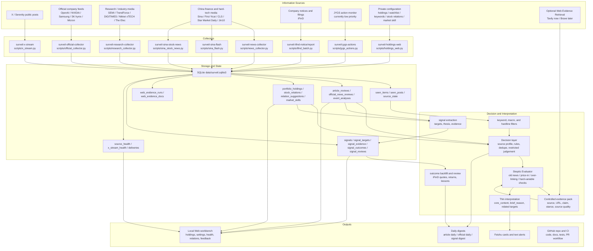
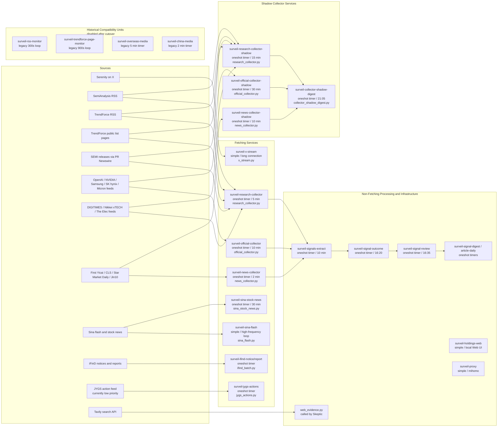
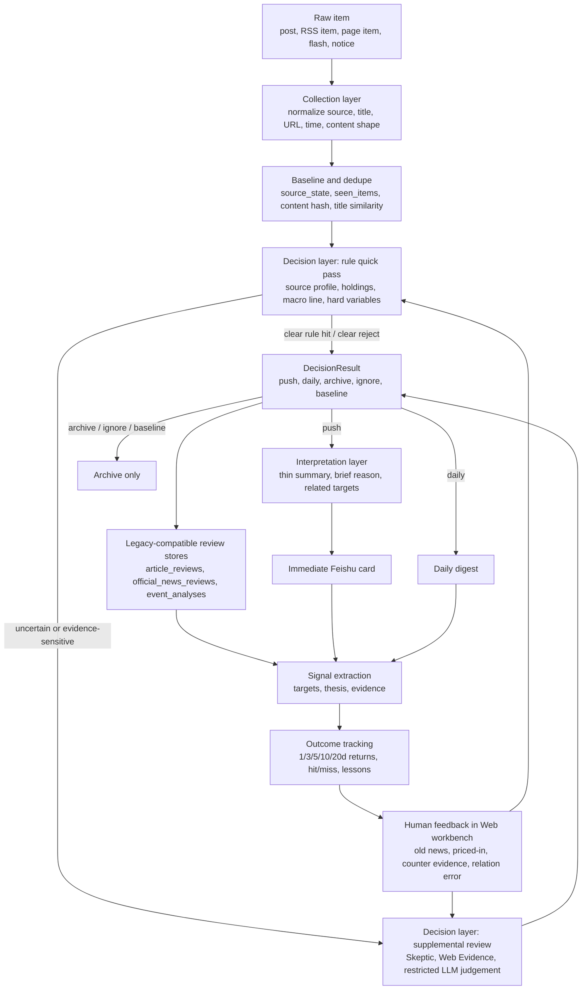
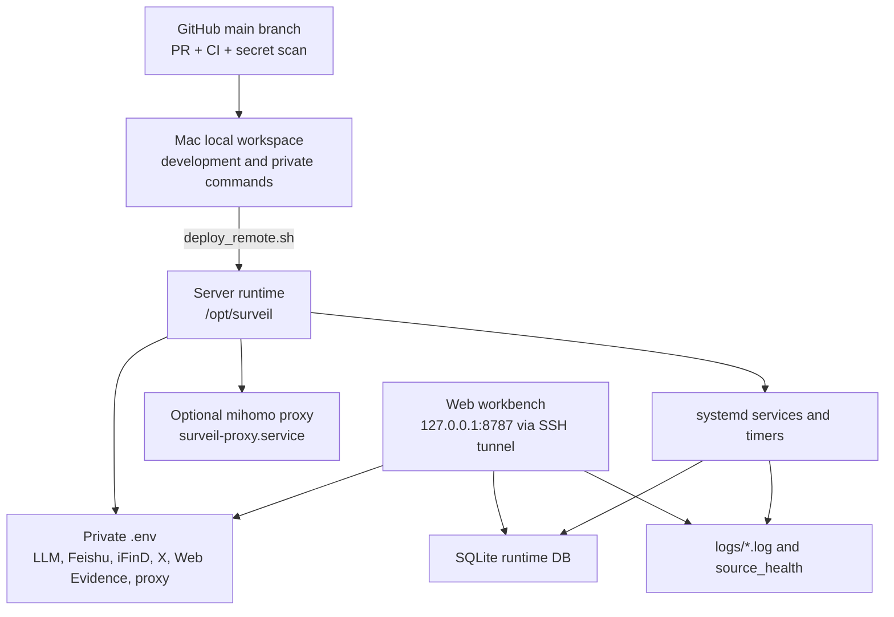
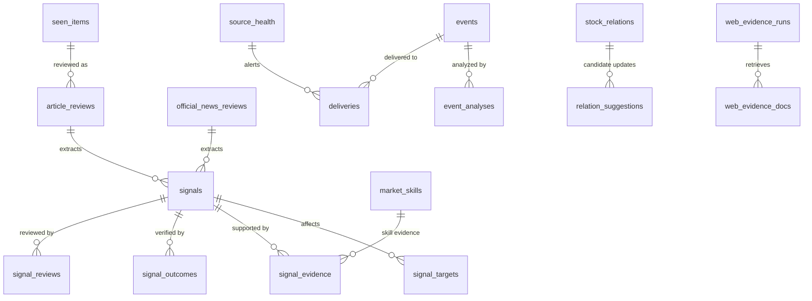

# MarketPulseWire Architecture Flow

This document summarizes the current project structure, information sources, processing layers, delivery paths, and feedback loop. It intentionally avoids private server addresses, tokens, cookies, real holdings, and personal account secrets.

## Runtime Spine Boundaries

All general research, news-media, official-company, flash, portfolio-news, notice, and report sources use the same production contract:

`collector -> NormalizedMarketItem -> market_flow -> decision_engine -> market_interpreter -> store adapter -> market_delivery -> view`

- `DecisionResult.action` is the push intent source. LLM output is normalized to `InterpretationResult` and cannot freely set or replace the push action.
- Research/news/official sources still enter through `market_content_flow`, while event-family sources still enter through `market_event_flow`; both wrappers now delegate decision and interpretation orchestration to the shared `market_flow` core. The wrappers adapt source shapes and legacy tables, not separate decision policies.
- `market_flow_adapters` owns raw event ingestion and explicit article/official/event compatibility-store writes. `market_delivery` owns article/official/event reservation, send execution, delivery status, and legacy pushed markers. Neither layer evaluates rules or calls the interpreter.
- `article_reviews`, `official_news_reviews`, and `events/event_analyses` remain compatibility storage truth for existing daily, Web, and signal readers.
- `SURVEIL_CONTENT_DIRECT_PATH` switches research/news/official production collectors as one group. `SURVEIL_EVENT_DIRECT_PATH` switches the four event-family sources as one group.
- X/Serenity intentionally stays on its `seen_posts` and direct-card route because media/thread semantics are source-specific.
- `value_directory_monitor` intentionally stays on its rule-first index/preview/OCR route and compatibility article-review storage. These two routes are explicit exclusions, not incomplete migrations.

## End-to-End Flow

## Source-to-Service Map

## Fetching Service Analysis Matrix

The health page uses the same high-level grouping: fetching services are separated from non-fetching processing and infrastructure. `simple` services stay alive and generally need a restart after environment changes. `oneshot` services are started by timers, run one batch, and exit; `inactive/dead/success` means the previous batch completed successfully. After the collector cutover, the default Web health view shows production units first and hides shadow / legacy compatibility units unless explicitly requested.

| Unit | Information source | Fetch range | Main filters / routing | Runtime shape | Frequency / trigger | Processing / compatibility path | Skeptic Evaluator | Tavily / Web Evidence |
|---|---|---|---|---|---|---|---|---|
| `surveil-x-stream.service` | X API filtered stream, currently focused on Serenity and configured X rules | Public X posts received from the stream; link/card enrichment is best-effort | X stream rules, account/list configuration, local delivery status retry; no article keyword prefilter | `simple` persistent | Long connection, reconnect on failure | X source path (`seen_posts`, X card/report path); not the legacy article/event review stores | No | No |
| `surveil-research-collector.timer` -> `.service` | SemiAnalysis, TrendForce RSS/pages, SEMI/PRNewswire, DIGITIMES, Nikkei xTECH, The Elec | Official RSS/RDF/list-page entries and public article bodies when accessible | Source profile enabled filtering; RSS/RDF runs every batch; page sources are internally throttled to 15 minutes by default | `oneshot` batch | Timer every 5 minutes; page cadence default 900 seconds | `market_content_flow` compatibility wrapper -> shared `market_flow` core -> Skeptic -> compatible `article_reviews` -> delivery/view | Yes | Yes, only through Skeptic |
| `surveil-value-directory.timer` -> `.service` | ValueList international-bank research lists: stocks and industry/macro | User-account-visible list metadata plus naturally visible first-page preview image/text on detail pages; no PDF download, no purchase/VIP bypass, no cookie export | Source profile enabled filtering; international-bank target/rating, holding keyword, holding relation, and major theme strategy hard rules | `oneshot` browser batch with private server Chromium profile | Daily 08:00, persistent timer | Value directory collection plus visible first-page preview/OCR, then rule-first decision and thin Feishu cards; compatible with `article_reviews` | No | No |
| `surveil-official-collector.timer` -> `.service` | OpenAI, NVIDIA, Samsung, SK hynix, Micron official feeds | Official RSS/Atom feed entries and public article bodies when accessible | Source profile enabled filtering; official-company source list only; ordinary marketing/newsroom items are downgraded by the decision layer | `oneshot` batch | Every 10 minutes | `market_content_flow` compatibility wrapper -> shared `market_flow` core -> Skeptic -> compatible `official_news_reviews` -> delivery/view | Yes | Yes, only through Skeptic |
| `surveil-news-collector.timer` -> `.service` | First Yicai, CLS public front-end roll API, Jin10 public/RSSHub important feed, Star Market Daily | Public flash/news/list entries from configured domestic sources | Source profile enabled filtering; CLS state/backoff and source focus filtering remain collector concerns; mandatory Yicai morning brief is an auditable decision rule | `oneshot` batch | Every 2 minutes | `market_content_flow` compatibility wrapper -> shared `market_flow` core -> Skeptic -> compatible `article_reviews` -> delivery/view | Yes | Yes, only through Skeptic |
| `surveil-sina-flash.service` | Sina Finance 7x24 flash API or optional Sina ZY provider | All fetched flash rows for configured tags/provider page | Match enabled holdings by code/name/aliases or macro policy line; dedupe into `events` | `simple` persistent | Script loop, default `SINA_FLASH_POLL_SECONDS=15` seconds | `market_event_flow` compatibility wrapper -> shared `market_flow` core -> compatible `events/event_analyses` -> delivery/view | No | No |
| `surveil-sina-stock-news.timer` -> `.service` | Sina per-stock public news page or optional Sina ZY stock news provider | For each enabled holding, latest `SINA_STOCK_NEWS_PER_STOCK_LIMIT` items, default 12 | Filter announcement-like items, AI-generated pages, holding exclude keywords; direct mention/business keyword pass; ambiguous items use relevance LLM | `oneshot` batch | Every 30 minutes | Collector relevance filter -> `market_event_flow` wrapper -> shared `market_flow` core -> compatible `events/event_analyses` -> delivery/view | No; current guard is relevance LLM + freshness hint | No |
| `surveil-ifind-notice.timer` -> `.service` | iFinD notices/filings for enabled holdings | Recent notices over the configured lookback window | Holdings universe, iFinD notice kind, event dedupe; PDF text extraction when available | `oneshot` batch | 08:00 and 20:00 | `market_event_flow` wrapper -> shared `market_flow` core with disclosure context -> compatible `events/event_analyses` -> delivery/view | No | No |
| `surveil-ifind-report.timer` -> `.service` | iFinD research/report data pool, if account permissions allow | Recent configured report formulas/report names | Disabled unless report env config is present; current deployment keeps it off when iFinD permission has no report data | `oneshot` batch | 08:00 and 20:00 when enabled | Optional report adapter -> `market_event_flow` wrapper -> shared `market_flow` core -> compatible `events/event_analyses` -> delivery/view | No | No |
| `surveil-jygs-actions.timer` -> `.service` | JYGS action/limit-up feed, currently low priority | Intraday action pool entries when enabled | Requires valid login cookie/API state; `ENABLE_JYGS_TIMER=1` gates the timer; LLM prediction path for selected events | `oneshot` batch | 12:30 and 16:00 when enabled | JYGS-specific event/prediction path, not article gate | No | No |
| `surveil-research-collector-shadow.timer` -> `.service` | SemiAnalysis, TrendForce RSS/pages, SEMI/PRNewswire, DIGITIMES, Nikkei xTECH, The Elec | Same source family as the target research/industry-media collector | Source profile enabled filtering; writes JSON shadow reports only | `oneshot` shadow batch | Every 15 minutes | Report-only direct decision shadow; no production review write or delivery | No | No |
| `surveil-official-collector-shadow.timer` -> `.service` | OpenAI, NVIDIA, Samsung, SK hynix, Micron official feeds | Official RSS/Atom feed candidates | Source profile enabled filtering; compares sampled candidates to existing `seen_items` / `official_news_reviews` | `oneshot` shadow batch | Every 30 minutes | Report-only direct decision shadow; no production review write or delivery | No | No |
| `surveil-news-collector-shadow.timer` -> `.service` | First Yicai, CLS, Star Market Daily, Jin10 | Domestic public news-media candidates | Source profile enabled filtering; focus/mandatory flags and direct decision shadow; does not touch CLS production poll state | `oneshot` shadow batch | Every 10 minutes | Report-only direct decision shadow; no production review write or delivery | No | No |

Non-fetching runtime units are intentionally omitted from this table: `surveil-signals-extract`, `surveil-signal-outcome`, `surveil-signal-review`, `surveil-signal-digest`, `surveil-article-daily`, `surveil-collector-shadow-digest`, `surveil-holdings-web`, and `surveil-proxy` operate on existing state, UI, logs, proxying, or post-processing rather than fetching new market information.

Historical compatibility units remain installed and whitelisted so operators can inspect or manually run them during rollback/debugging, but production deployments keep them disabled after cutover:

| Legacy unit | Replaced by | Notes |
|---|---|---|
| `surveil-rss-monitor.service` | `surveil-research-collector.timer` and `surveil-official-collector.timer` | Kept for rollback/debugging; `DISABLE_LEGACY_RSS_MONITOR=1` keeps it off. |
| `surveil-trendforce-page-monitor.service` | `surveil-research-collector.timer` | Kept for rollback/debugging; `DISABLE_LEGACY_RESEARCH_MONITORS=1` keeps it off. |
| `surveil-overseas-media.timer` -> `.service` | `surveil-research-collector.timer` | Kept for rollback/debugging; `DISABLE_LEGACY_RESEARCH_MONITORS=1` keeps it off. |
| `surveil-china-media.timer` -> `.service` | `surveil-news-collector.timer` | Kept for rollback/debugging; `DISABLE_LEGACY_CHINA_MEDIA_MONITOR=1` keeps it off. |

The Web workbench exposes a `source_profiles.py` catalog above these systemd units. It groups sources into the six target categories used by the production cleanup plan: X / Serenity, Research / industry media, official company sources, news media, Sina portfolio stock news, and iFinD company disclosures. Source profiles now show the unified production collectors while keeping the original `source_health` monitor/source labels for historical continuity.

## Decision and Delivery Layers

## Runtime and Configuration

## Main Data Tables

## Key Operating Principles

- Primary and official feeds are preferred over page scraping where available.
- Paid, logged-in, or protected content is not bypassed.
- Low-signal items go to daily digests instead of immediate Feishu alerts.
- High-impact semiconductor, AI infrastructure, macro policy, and holdings-related items pass through LLM gate plus Skeptic.
- Web Evidence Retrieval is controlled by the project: the search API returns evidence, MarketPulseWire stores and compresses it, and the configured LLM receives only the evidence pack.
- SQLite is the live runtime state. Private JSON files remain backup/migration snapshots for user-specific settings such as stock relations.
- GitHub is the code source of truth; server `.env`, SQLite, logs, proxy config, and personal holdings remain private runtime state.
