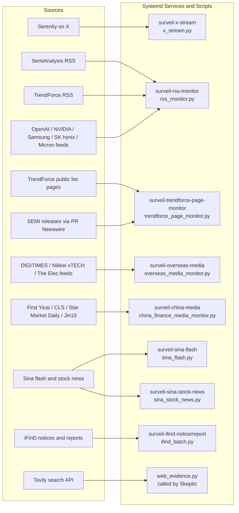
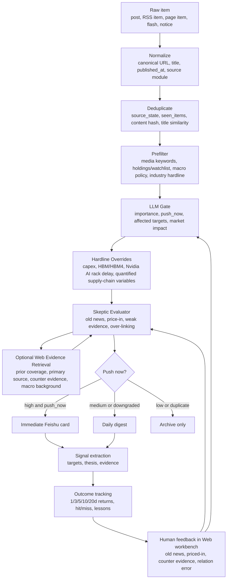
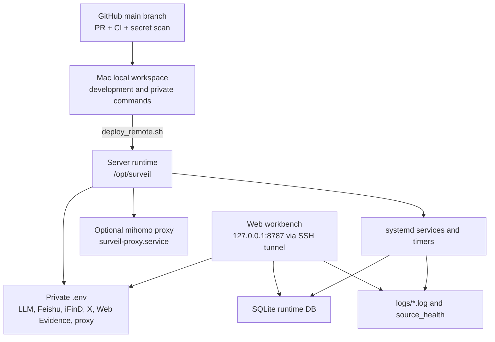
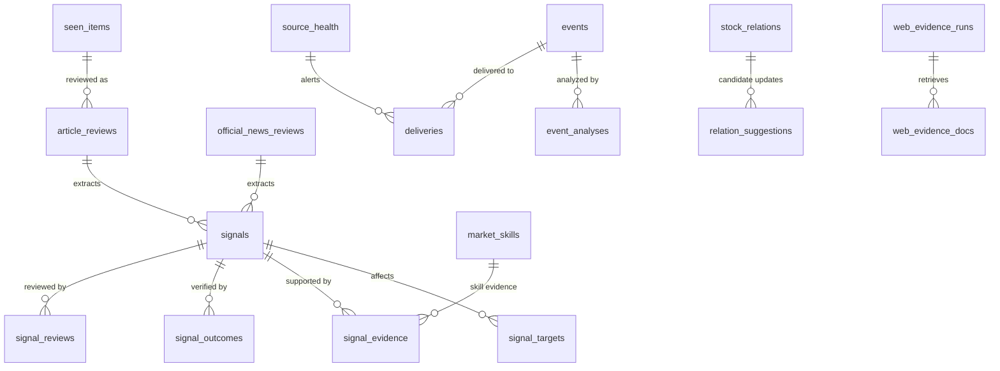

# MarketPulseWire Architecture Flow

This document summarizes the current project structure, information sources, processing pipeline, delivery paths, and feedback loop. It intentionally avoids private server addresses, tokens, cookies, real holdings, and personal account secrets.

## End-to-End Flow

```mermaid
flowchart TD
    subgraph S["Information Sources"]
        X["X / Serenity public posts"]
        Official["Official company feeds<br/>OpenAI / NVIDIA / Samsung / SK hynix / Micron"]
        Industry["Industry media and research<br/>SEMI / TrendForce / DIGITIMES / Nikkei xTECH / The Elec"]
        China["China finance and hard-tech media<br/>Sina / First Yicai / CLS / Star Market Daily / Jin10"]
        Notices["Company notices and filings<br/>iFinD"]
        JYGS["JYGS action monitor<br/>currently low priority"]
        Config["Private configuration<br/>holdings / watchlist / keywords / stock relations / market skill"]
        WebSearch["Optional Web Evidence Retrieval<br/>Tavily now / Brave later"]
    end

    subgraph C["Collectors"]
        XStream["surveil-x-stream<br/>scripts/x_stream.py"]
        RSS["surveil-rss-monitor<br/>scripts/rss_monitor.py"]
        Overseas["surveil-overseas-media<br/>scripts/overseas_media_monitor.py"]
        TrendPage["surveil-trendforce-page-monitor<br/>scripts/trendforce_page_monitor.py"]
        ChinaMedia["surveil-china-media<br/>scripts/china_finance_media_monitor.py"]
        SinaFlash["surveil-sina-flash<br/>scripts/sina_flash.py"]
        SinaStock["surveil-sina-stock-news<br/>scripts/sina_stock_news.py"]
        Ifind["surveil-ifind-notice/report<br/>scripts/ifind_batch.py"]
        JYGSJob["surveil-jygs-actions<br/>scripts/jygs_actions.py"]
        WebWorkbench["surveil-holdings-web<br/>scripts/holdings_web.py"]
    end

    subgraph D["Storage and State"]
        SQLite["SQLite data/surveil.sqlite3"]
        Seen["seen_items / seen_posts / source_state"]
        Reviews["article_reviews / official_news_reviews / event_analyses"]
        Relations["portfolio_holdings / stock_relations / relation_suggestions / market_skills"]
        Evidence["web_evidence_runs / web_evidence_docs"]
        Signals["signals / signal_targets / signal_evidence / signal_outcomes / signal_reviews"]
        Health["source_health / x_stream_health / deliveries"]
    end

    subgraph A["Analysis"]
        Keyword["keyword and macro/hardline filters"]
        Gate["LLM importance gate<br/>article_gate / official_news_gate / event_pipeline"]
        Skeptic["Skeptic Evaluator<br/>old news / price-in / over-linking / hard-variable checks"]
        EvidenceLayer["Controlled evidence pack<br/>source, URL, claim, stance, source quality"]
        SignalExtract["signal extraction<br/>targets, thesis, evidence"]
        Outcome["outcome backfill and review<br/>iFinD quotes, returns, lessons"]
    end

    subgraph O["Outputs"]
        Feishu["Feishu cards and text alerts"]
        Daily["Daily digests<br/>article daily / official daily / signal digest"]
        Workbench["Local Web workbench<br/>holdings, settings, health, relations, feedback"]
        GitHub["GitHub repo and CI<br/>code, docs, tests, PR workflow"]
    end

    X --> XStream
    Official --> RSS
    Industry --> RSS
    Industry --> Overseas
    Industry --> TrendPage
    China --> ChinaMedia
    China --> SinaFlash
    China --> SinaStock
    Notices --> Ifind
    JYGS --> JYGSJob
    Config --> WebWorkbench
    WebSearch --> EvidenceLayer

    XStream --> SQLite
    RSS --> SQLite
    Overseas --> SQLite
    TrendPage --> SQLite
    ChinaMedia --> SQLite
    SinaFlash --> SQLite
    SinaStock --> SQLite
    Ifind --> SQLite
    JYGSJob --> SQLite
    WebWorkbench --> SQLite

    SQLite --> Seen
    SQLite --> Reviews
    SQLite --> Relations
    SQLite --> Evidence
    SQLite --> Signals
    SQLite --> Health

    Seen --> Keyword
    Reviews --> Gate
    Relations --> Gate
    Keyword --> Gate
    Gate --> Skeptic
    Skeptic --> EvidenceLayer
    EvidenceLayer --> Skeptic
    Skeptic --> Feishu
    Skeptic --> Daily
    Reviews --> SignalExtract
    Relations --> SignalExtract
    SignalExtract --> Signals
    Signals --> Outcome
    Outcome --> Daily
    Health --> Workbench
    Reviews --> Workbench
    Signals --> Workbench
    Relations --> Workbench
```

## Source-to-Service Map

## Decision and Delivery Pipeline

## Runtime and Configuration

## Main Data Tables

## Key Operating Principles

- Primary and official feeds are preferred over page scraping where available.
- Paid, logged-in, or protected content is not bypassed.
- Low-signal items go to daily digests instead of immediate Feishu alerts.
- High-impact semiconductor, AI infrastructure, macro policy, and holdings-related items pass through LLM gate plus Skeptic.
- Web Evidence Retrieval is controlled by the project: the search API returns evidence, MarketPulseWire stores and compresses it, and the configured LLM receives only the evidence pack.
- SQLite is the live runtime state. Private JSON files remain backup/migration snapshots for user-specific settings such as stock relations.
- GitHub is the code source of truth; server `.env`, SQLite, logs, proxy config, and personal holdings remain private runtime state.

