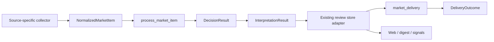

# MarketPulseWire Current Architecture

This document is an as-built map of the current code and production shape. Engineering rules live in `AGENTS.md`; active work lives in the local `docs/monitoring-plan.md`; deployment operations live in `docs/deployment.md`.

## Runtime Spine

All general research, industry-media, news-media, official-company, official trade-policy, flash, portfolio-news, AlphaAbstract, ValueList, and iFinD items use one runtime entry:

```text
collector
-> NormalizedMarketItem
-> process_market_item
-> decision_engine
-> market_interpreter
-> review store adapter
-> market_delivery
-> Web / digest / Feishu
```



`DecisionResult.action` is the only push-eligibility input accepted by delivery. Delivery execution may still produce `sent`, `duplicate`, `skipped`, or `failed`. Missing decisions cannot fall back to legacy push fields.

The former direct/compat route switch and these wrapper modules have been removed:

- `article_gate.py`
- `official_news_gate.py`
- `content_runtime.py`
- `event_runtime.py`
- `market_content_flow.py`
- `market_event_flow.py`
- `event_pipeline.py`

## Module Ownership

| Module | Current responsibility |
|---|---|
| `market_runtime.py` | Normalization boundary, store adapter selection, orchestration, fail-closed contract handling |
| `decision_engine.py` | Deterministic `DecisionResult`, including final push action |
| `trade_friction.py` | Source-neutral China-US / China-EU trade-friction classification and evidence extraction |
| `trade_policy_monitor.py` | Official API/RSS/list discovery, new-item detail enrichment, baseline and source health |
| `market_interpreter.py` | Thin interpretation and bounded LLM output normalization |
| `market_content_adapter.py` | Article and official-news compatibility payload/store shape |
| `market_event_adapter.py` | Event compatibility payload/store shape |
| `market_review_store.py` | SQLite review/event persistence and historical row loading |
| `market_delivery.py` | Dedup reservation, Feishu execution, delivery status, pushed markers |
| `market_view.py` | Read-only unified projection across existing stores |
| `source_profiles.py` | Source catalog, runtime ownership, health keys and editable source settings |

## Production Sources

| Source group | Production entry | Item processing |
|---|---|---|
| Research and industry media | `research_collector.py` -> `rss_monitor.py` / `trendforce_page_monitor.py` / `alphabstract_monitor.py` | Unified runtime, article store |
| Official company feeds | `official_collector.py` -> `rss_monitor.py` | Unified runtime, official-news store |
| Domestic and overseas news media | `news_collector.py` -> `china_finance_media_monitor.py` / RSS helpers | Unified runtime, article store |
| Official trade policy | `news_collector.py` -> `trade_policy_monitor.py` | Federal Register, USTR, European Commission and MOFCOM public sources; unified runtime, article store |
| Sina 7x24 flash | `sina_flash.py` | Unified runtime, event store |
| Sina portfolio stock news | `sina_stock_news.py` | Relevance enrichment, then unified runtime and event store |
| iFinD company disclosures | `ifind_batch.py` | Unified runtime and event store; the batch summary is an operational card |
| AlphaAbstract research summaries | `alphabstract_monitor.py` through `research_collector.py` | Public sitemap/page enrichment, then unified runtime and article store |
| ValueList research directory | `value_directory_monitor.py` | Private browser/OCR enrichment, then unified runtime and article store |

Source-specific login, WAF, API, sitemap discovery, polling, browser profile, OCR and attachment behavior ends before the normalized runtime boundary.

The `trade_friction_escalation` rule is not tied to the official source group. It runs in `decision_engine.py` for every normalized current or future source. Explicit policy procedures, instruments, retaliation or worsening China-US / China-EU relations can produce `push`; weaker explicit tension can produce `daily`; routine administrative reviews and generic diplomacy do not receive an alert action.

## Storage

The project keeps the existing physical stores:

- `article_reviews`
- `official_news_reviews`
- `events` / `event_analyses`
- `seen_items`, `seen_posts`, `source_state`
- `rule_alert_dedup`, `deliveries`
- `source_health`, `x_stream_health`
- portfolio, relation, evidence and signal tables

`push_now`, `should_push_now` and `should_push` remain compatibility columns for historical readers and old rows. New delivery code does not read them as action inputs. `pushed_at` and delivery rows record what happened, not what should be sent.

## Independent Routes

### X / Serenity

`x_stream.py` keeps its dedicated stream, thread/media enrichment, `seen_posts` state and X card delivery. The general article/event stores do not currently represent those semantics cleanly. Regression coverage lives in `test_x_stream_health.py`.

Review condition: reconsider convergence when X posts can be represented without losing thread/media rendering or stream retry state.

### JYGS Actions

`jygs_actions.py` remains a disabled-by-default legacy product path for JYGS action prediction and its dedicated card. It is not a general market-information source profile. Its direct LLM prediction contract is isolated in that module and covered by `test_jygs_actions.py`.

Review condition: retire the path or move it behind `NormalizedMarketItem` and deterministic decisions before enabling it as a normal production source.

## Runtime And Deployment Facts

- Production runs on the server under systemd; collector timers and persistent services are listed in `docs/deployment.md`.
- The server Web panel and private server `.env` are the production configuration truth.
- Private `.env`, portfolio data, SQLite, browser profiles, cookies and local source overrides are excluded from Git and deployment replacement.
- X/Serenity and ValueList access stay within the API/account-visible boundary; the project does not bypass subscriptions, paywalls, WAF or authentication controls.
- CI compiles scripts, runs regression tests, scans secrets and executes `test_architecture_invariants.py` to prevent the unified spine from drifting.
