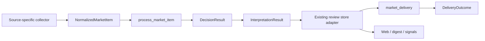

# MarketPulseWire Current Architecture

This document is an as-built map of the current code and production shape. Engineering rules live in `AGENTS.md`; active work lives in the local `docs/monitoring-plan.md`; deployment operations live in `docs/deployment.md`.

## Runtime Spine

All general research, industry-media, news-media, official-company, official trade-policy, flash, portfolio-news, company-disclosure, AlphaAbstract, and ValueList items use one runtime entry:

```text
collector
-> NormalizedMarketItem
-> process_market_item
-> decision_engine
-> market_interpreter
-> review store adapter
-> market_delivery
-> Web / digest / Feishu
```



`DecisionResult.action` is the only push-eligibility input accepted by delivery. Delivery execution may still produce `sent`, `duplicate`, `skipped`, or `failed`. Missing decisions cannot fall back to legacy push fields. For a push-eligible intraday Chinese equity market move, delivery may derive a conservative source-neutral fact identity from the Beijing market date, direction, literal concept, and an already matched holding/keyword target; the first reservation sends and later matching source retransmissions are recorded as duplicates without changing the decision.

Pure, source-neutral statements of an established Federal Reserve policy-transmission relationship, such as easing benefiting gold, Bitcoin, non-US currencies or metals, are deterministically downgraded from `push` to `daily` after the macro rule. This downgrade applies only when the item contains no actual policy decision, quantified rate-path repricing, quantified observed asset move, unusual inverse relationship, correction, direct Fed statement or asset-specific hard fact. It retains the original rule hit and records the initial/final action plus local evidence in the decision audit; it cannot promote a non-push action.

Push-eligible US CPI, PCE and nonfarm coverage may also receive a delivery-only identity from locally bound evidence. Preview and actual-release identities use country, indicator and reference period. The extractor considers every indicator occurrence in a claim before binding the nearest preceding reference month, so an early generic `CPI` label cannot hide a later locally complete `6月...CPI月率` fact. Market reactions use the same reference period, conservatively inferring the immediately preceding month when a reaction names the indicator but omits the period, so cross-asset and next-day retellings converge. Each phase can deliver once across sources. Corrections, policy decisions, quantified path repricing, unusual inverse relationships, asset-specific hard facts and direct Kevin Warsh statements bypass the reaction identity, including when a retained fact is mixed with already-covered market interpretation. Other cross-asset reactions to a Fed easing or tightening impulse without a named data release share one direction-specific 14-day delivery identity. The extractors use original item text and deterministic evidence only; delivery dedup does not change the decision or use an LLM.

Push-eligible industry-hardline coverage may receive a bounded 36-hour delivery-only fact identity when original text deterministically supplies subject, event, stage, object and direction. The initial event families cover IBM enterprise spending shifting toward memory hardware and CoreWeave exploring derivatives to hedge storage-chip price downside. Cross-source rewrites remain push decisions but are recorded as duplicates. Corrections, company confirmation or denial, execution-stage changes, material derivative terms and independently attributable HBM/DRAM/NAND supplier production facts bypass the prior identity.

Push-eligible holding or industry-hardline coverage may also receive source-neutral company-event delivery identities. Claim-local stock codes, direct holding entities and validated company-name/action grammar resolve explicit subjects without an issuer allowlist. Common company actions use strict structured slots, while the conservative generic path requires an explicit subject, action family, reference/effective time and distinctive counterparty, object or quantitative anchor. Each item may produce a fact set rather than one selected key. The delivery layer reserves every new identity in one immediate SQLite transaction, suppresses only when the entire set is already covered, confirms all reservations after send success and releases all after failure. Stable event identity is separated from lifecycle/material version so equivalent or subset restatements deduplicate while explicit corrections, revisions, approvals, completions and terminations remain deliverable. The predecessor's five bounded keys remain only as migration aliases. These execution records preserve the original `DecisionResult.action=push`.

The former direct/compat route switch and these wrapper modules have been removed:

- `article_gate.py`
- `official_news_gate.py`
- `content_runtime.py`
- `event_runtime.py`
- `market_content_flow.py`
- `market_event_flow.py`
- `event_pipeline.py`

## Module Ownership

| Module | Current responsibility |
|---|---|
| `market_runtime.py` | Normalization boundary, store adapter selection, orchestration, fail-closed contract handling |
| `decision_engine.py` | Deterministic `DecisionResult`, including final push action |
| `ai_credit_risk.py` | Source-neutral deterministic AI borrower, funding-event and qualitative credit-stress evidence classification |
| `ai_compute_supply_demand.py` | Source-neutral deterministic AI compute supply, demand, capacity and constraint classification |
| `trade_friction.py` | Source-neutral China-US / China-EU trade-friction classification and evidence extraction |
| `trade_policy_monitor.py` | Official API/RSS/list discovery, new-item detail enrichment, baseline and source health |
| `company_disclosures.py` | One logical portfolio-disclosure collector, provider selection, baseline, source state and health |
| `disclosure_providers.py` / `cninfo_disclosure_provider.py` | Provider-neutral disclosure contract and CNINFO public-query transport |
| `disclosure_document.py` | Shared bounded PDF download, SHA-256 and `pypdf` text extraction |
| `market_interpreter.py` | Thin interpretation and bounded LLM output normalization |
| `market_content_adapter.py` | Article and official-news compatibility payload/store shape |
| `market_event_adapter.py` | Event compatibility payload/store shape |
| `market_review_store.py` | SQLite review/event persistence and historical row loading |
| `market_delivery.py` | Rule/fact dedup reservation, Feishu execution, delivery status, pushed markers |
| `market_feedback.py` | Cross-source append-only human feedback, signed item identity, last-click-wins projection and quality aggregates |
| `feishu_app.py` / `feishu_feedback_service.py` | Feedback-enabled application-bot send and official long-connection card callbacks |
| `macro_event_dedup.py` | Delivery-only US macro preview/release/reaction and Fed policy cross-asset reaction identities, including mixed-Warsh handling |
| `industry_fact_dedup.py` | Bounded delivery-only industry fact identities and material-update exclusions |
| `company_event_dedup.py` | Generic claim-local company-event fact sets, lifecycle versions and legacy reservation aliases |
| `market_view.py` | Read-only unified projection across existing stores |
| `source_profiles.py` | Source catalog, runtime ownership, health keys and editable source settings |

## Production Sources

| Source group | Production entry | Item processing |
|---|---|---|
| Research and industry media | `research_collector.py` -> `rss_monitor.py` / `trendforce_page_monitor.py` / `alphabstract_monitor.py` | Unified runtime, article store |
| Official company feeds | `official_collector.py` -> `rss_monitor.py` | Unified runtime, official-news store |
| Domestic and overseas news media | `news_collector.py` -> `china_finance_media_monitor.py` / `wallstreetcn_monitor.py` / RSS helpers | Sina, Yicai, CLS, Jin10 and WallstreetCN public article/flash discovery; unified runtime, article store |
| Official trade policy | `news_collector.py` -> `trade_policy_monitor.py` | Federal Register, USTR, European Commission and MOFCOM public sources; unified runtime, article store |
| Sina 7x24 flash | `sina_flash.py` | Unified runtime, event store |
| Sina portfolio stock news | `sina_stock_news.py` | Relevance enrichment, then unified runtime and event store |
| Company disclosures | `company_disclosures.py` -> `cninfo_disclosure_provider.py` | Twice daily CNINFO fulltext/relation discovery and official-PDF enrichment; report-only writes baseline event audits, while live mode enables analysis and delivery |
| AlphaAbstract research summaries | `alphabstract_monitor.py` through `research_collector.py` | Public sitemap/page enrichment, then unified runtime and article store |
| ValueList research directory | `value_directory_monitor.py` | Private browser/OCR enrichment, then unified runtime and article store |

Source-specific login, WAF, API, sitemap discovery, polling, browser profile, OCR and attachment behavior ends before the normalized runtime boundary.

Synchronous HTTP connection pools are isolated per worker thread. A source retry or timeout-key change may close only that thread's client; concurrent collectors cannot close another thread's in-flight TLS connection or leave a stale network writer targeting a reused SQLite file descriptor.

Company disclosures use the logical source `company_disclosures`. `transport_provider` remains raw audit metadata and cannot affect importance or action. The current fixed provider factory contains `cninfo_public`; a future provider implements the same security-resolution and paginated-list contract and is selected through the private source profile. CNINFO `orgId` mappings, provider baselines and provider-neutral known identities use the existing `source_state`. Fulltext announcements and `relation/category_dyhd_szdy` investor-relations records are queried separately, then normalized identically. A provider's first successful run and every `report_only` discovery enter the unified event runtime only as `baseline_only` audits with analysis and delivery disabled. They remain visible behind Event Center's baseline filter but cannot create a decision, AI interpretation or notification. Historical `ifind_notice` event rows remain readable compatibility data; the expired iFinD announcement timer is removed.

CLS telegraph collection preserves bounded official product metadata in the normalized raw audit: numeric `type`, the official bracketed product label, `share_img`/VIP status, and parsed `author_extends` stock names/codes. Article cards display these fields for an observation phase approved by the user. The metadata does not enter deterministic rule matching, importance or `DecisionResult.action`; the existing public `content` remains the decision text.

The `trade_friction_escalation` rule is not tied to the official source group. It runs in `decision_engine.py` for every normalized current or future source. Explicit policy procedures, instruments, retaliation or worsening China-US / China-EU relations can produce `push`; weaker explicit tension can produce `daily`; routine administrative reviews and generic diplomacy do not receive an alert action.

The `international_bank_fed_rate_path_revision` rule is also source-neutral. It requires local attributed evidence that an audited major international bank changed its expected Federal Reserve hike/cut direction, count, timing, cumulative basis points or terminal rate. Material revisions produce `push`; a concrete current forecast without a provable revision produces `daily`. WallstreetCN identity and category metadata cannot create eligibility. Same-report reposts use the existing `rule_alert_dedup` reservation, while a later genuine path revision remains eligible.

Attributed-research delivery identities normally use the validated institution, topic, event family and locally retained horizon. The feedback-confirmed SEMI 2026 equipment-sales forecast uses a bounded canonical report identity anchored by institution, equipment-sales subject, 2026 horizon and normalized USD 165.9 billion metric; Chinese and English rewrites converge while each rewrite carries its prior generic hash as a migration alias. Other SEMI reports continue using the generic attributed-research identity.

The ordered `investment_bank_rating_target_direct_holding` rule requires one local evidence window to bind a recognized institution, one directly mentioned holding and an actual rating, target-price or coverage action. An attached collector symbol, a generic earnings-estimate revision or institution/holding/action terms scattered across a multi-company article cannot create this rule hit. Bounded adjacent-sentence attribution is accepted only when the second sentence explicitly continues with `该行` / `其` / `the bank` or an equivalent report reference.

The Rule Center exposes execution semantics from the runtime registry. Rules inside `first_matching_push_rule()` use `ordered_first_match` and retain an editable priority. Fed-path, trade-friction, attributed-research, industry-hardline and AI credit-risk rules are evaluated independently in `decision_engine`, use `parallel_merge`, and expose no priority setting; multiple push-eligible hits are combined rather than suppressing one another.

The `ai_hyperscaler_credit_stress` rule is source-neutral and uses deterministic local evidence only. It covers Alphabet/Google, Amazon/AWS, Meta, Microsoft, Oracle, NVIDIA, SpaceX and OpenAI when AI infrastructure purpose and debt context are locally bound. Ordinary issuance and one qualitative concern produce `daily`; an explicit financing/capex/rating/liquidity hard outcome, or at least two independent stress families including a concrete market outcome, can produce `push`. The rule uses no LLM extraction, external bond feed or numeric spread/leverage threshold. Generic financing no longer counts as an industry-hardline capex/investment event by itself.

The `ai_compute_supply_demand` rule is a source-neutral deterministic `parallel_merge` rule. It binds subject, compute resource, event, direction, stage and verbatim evidence. Generic confidence, forecasts, non-binding intentions, downstream demand and unbound price moves remain `daily` or unmatched. Its catalyst identity uses the existing atomic `rule_alert_dedup` path.

## Storage

The project keeps the existing physical stores:

- `article_reviews`
- `official_news_reviews`
- `events` / `event_analyses`
- `seen_items`, `seen_posts`, `source_state`
- `rule_alert_dedup`, `deliveries` (`rule_alert_dedup` also records delivery-only intraday market-move, US macro event, bounded industry-fact and generic company-event fact-set reservations)
- `market_feedback` (append-only Feishu feedback events; the latest valid operator/item click is the current projection)
- `source_health`, `x_stream_health`
- portfolio, relation, evidence and signal tables

`article`, `official` and `event` are storage/audit identities, not decision-pipeline identities. All three arrive through the unified runtime above. `article_reviews` remains the broad media/research review store, `official_news_reviews` remains an active compatibility store for official-news readers and daily output, and `events` / `event_analyses` / `deliveries` retain event identity, repeated analyses and explicit delivery audits. Their schemas originated before runtime unification, but current production readers still use them; removing them requires a separate canonical-schema migration with backfill, dual-read verification and rollback.

`push_now`, `should_push_now` and `should_push` remain compatibility columns for historical readers and old rows. New delivery code does not read them as action inputs. `pushed_at` and delivery rows record what happened, not what should be sent.

When Feishu market feedback is explicitly enabled, unified article, official-news and event cards are sent by the configured enterprise application bot and carry signed `特别有用` / `重复` / `无效` actions. The delivery audit retains the feedback-card base payload for cards sent after this feature is enabled. After a valid action, the official long-connection callback appends only to `market_feedback` and returns a replacement of that same Feishu card with `反馈状态` and a `✓` on the current label; clicking that selected label again appends a superseding `cleared` event and restores the unselected card instead of deleting history. It cannot modify decisions, delivery reservations, source settings or rule settings. Legacy cards without a retained base payload keep their Toast acknowledgement rather than receiving a lossy replacement. `FEISHU_FEEDBACK_LISTENER_ENABLED` may start that listener for an isolated test card while leaving natural unified delivery on the pre-existing custom webhook. Test-card rows and current `cleared` states are excluded from quality denominators and Event Center feedback projection. Current feedback is selected by Feishu action time, then insertion id, so delayed callbacks cannot overwrite or cancel a newer choice. The Web workbench exposes feedback coverage and observed labelled-card outcomes by source, primary rule, all rule associations and source-by-primary-rule. Its Event Center also reads the same current projection through `item_kind + source + item_id`, showing feedback on the three active store adapters and filtering inside each store query before limits. This projection is read-only, excludes test cards and operator identities, and distinguishes delivered-but-unlabelled, not-delivered and unsupported-route rows.

## Independent Routes

### X / Serenity

`x_stream.py` keeps its dedicated stream, thread/media enrichment, `seen_posts` state and X card delivery. The general article/event stores do not currently represent those semantics cleanly. Regression coverage lives in `test_x_stream_health.py`.

Review condition: reconsider convergence when X posts can be represented without losing thread/media rendering or stream retry state.

### JYGS Actions

`jygs_actions.py` remains a disabled-by-default legacy product path for JYGS action prediction and its dedicated card. It is not a general market-information source profile. Its direct LLM prediction contract is isolated in that module and covered by `test_jygs_actions.py`.

Review condition: retire the path or move it behind `NormalizedMarketItem` and deterministic decisions before enabling it as a normal production source.

## Runtime And Deployment Facts

- Production runs on an Alibaba Cloud Debian 12 server under systemd; collector timers and persistent services are listed in `docs/deployment.md`.
- The server Web panel and private server `.env` are the production configuration truth.
- Private `.env`, portfolio data, SQLite, browser profiles, cookies and local source overrides are excluded from Git and deployment replacement.
- X/Serenity and ValueList access stay within the API/account-visible boundary; the project does not bypass subscriptions, paywalls, WAF or authentication controls.
- CI compiles scripts, runs regression tests, scans secrets and executes `test_architecture_invariants.py` to prevent the unified spine from drifting.
