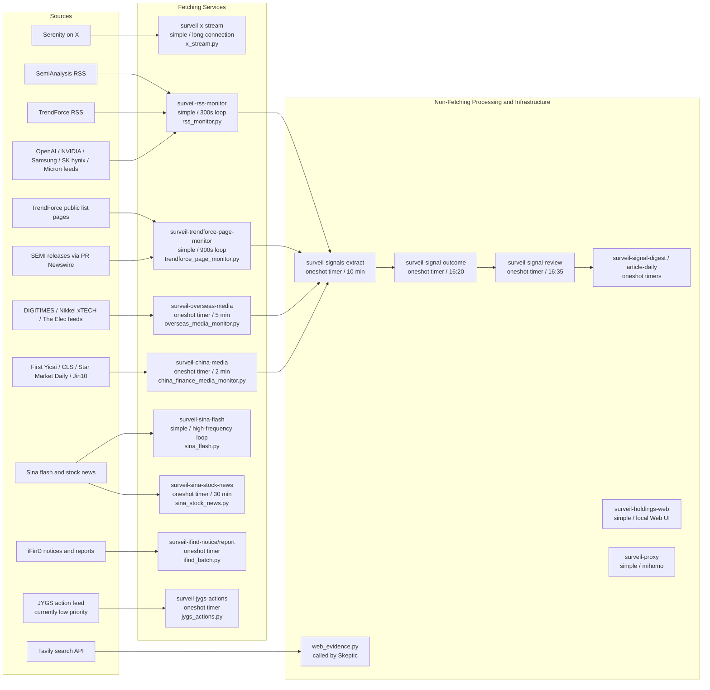
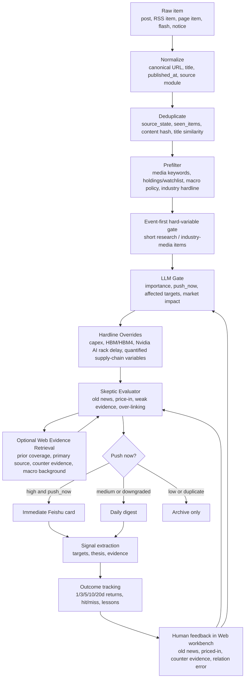
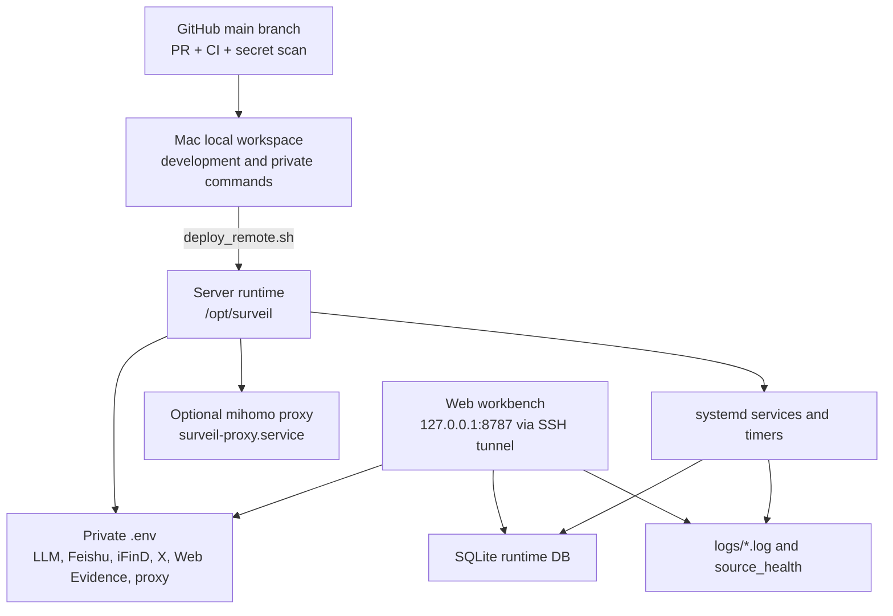
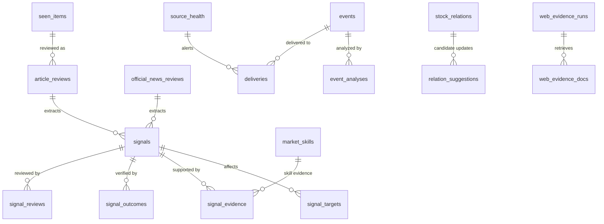

# MarketPulseWire Architecture Flow

This document summarizes the current project structure, information sources, processing pipeline, delivery paths, and feedback loop. It intentionally avoids private server addresses, tokens, cookies, real holdings, and personal account secrets.

## End-to-End Flow

```mermaid
flowchart TD
    subgraph S["Information Sources"]
        X["X / Serenity public posts"]
        Official["Official company feeds<br/>OpenAI / NVIDIA / Samsung / SK hynix / Micron"]
        Industry["Research / industry media<br/>SEMI / TrendForce / DIGITIMES / Nikkei xTECH / The Elec"]
        China["China finance and hard-tech media<br/>Sina / First Yicai / CLS / Star Market Daily / Jin10"]
        Notices["Company notices and filings<br/>iFinD"]
        JYGS["JYGS action monitor<br/>currently low priority"]
        Config["Private configuration<br/>holdings / watchlist / keywords / stock relations / market skill"]
        WebSearch["Optional Web Evidence Retrieval<br/>Tavily now / Brave later"]
    end

    subgraph C["Collectors"]
        XStream["surveil-x-stream<br/>scripts/x_stream.py"]
        RSS["surveil-rss-monitor<br/>scripts/rss_monitor.py"]
        Overseas["surveil-overseas-media<br/>scripts/overseas_media_monitor.py"]
        TrendPage["surveil-trendforce-page-monitor<br/>scripts/trendforce_page_monitor.py"]
        ChinaMedia["surveil-china-media<br/>scripts/china_finance_media_monitor.py"]
        SinaFlash["surveil-sina-flash<br/>scripts/sina_flash.py"]
        SinaStock["surveil-sina-stock-news<br/>scripts/sina_stock_news.py"]
        Ifind["surveil-ifind-notice/report<br/>scripts/ifind_batch.py"]
        JYGSJob["surveil-jygs-actions<br/>scripts/jygs_actions.py"]
        WebWorkbench["surveil-holdings-web<br/>scripts/holdings_web.py"]
    end

    subgraph D["Storage and State"]
        SQLite["SQLite data/surveil.sqlite3"]
        Seen["seen_items / seen_posts / source_state"]
        Reviews["article_reviews / official_news_reviews / event_analyses"]
        Relations["portfolio_holdings / stock_relations / relation_suggestions / market_skills"]
        Evidence["web_evidence_runs / web_evidence_docs"]
        Signals["signals / signal_targets / signal_evidence / signal_outcomes / signal_reviews"]
        Health["source_health / x_stream_health / deliveries"]
    end

    subgraph A["Analysis"]
        Keyword["keyword and macro/hardline filters"]
        Gate["LLM importance gate<br/>article_gate / official_news_gate / event_pipeline"]
        Skeptic["Skeptic Evaluator<br/>old news / price-in / over-linking / hard-variable checks"]
        EvidenceLayer["Controlled evidence pack<br/>source, URL, claim, stance, source quality"]
        SignalExtract["signal extraction<br/>targets, thesis, evidence"]
        Outcome["outcome backfill and review<br/>iFinD quotes, returns, lessons"]
    end

    subgraph O["Outputs"]
        Feishu["Feishu cards and text alerts"]
        Daily["Daily digests<br/>article daily / official daily / signal digest"]
        Workbench["Local Web workbench<br/>holdings, settings, health, relations, feedback"]
        GitHub["GitHub repo and CI<br/>code, docs, tests, PR workflow"]
    end

    X --> XStream
    Official --> RSS
    Industry --> RSS
    Industry --> Overseas
    Industry --> TrendPage
    China --> ChinaMedia
    China --> SinaFlash
    China --> SinaStock
    Notices --> Ifind
    JYGS --> JYGSJob
    Config --> WebWorkbench
    WebSearch --> EvidenceLayer

    XStream --> SQLite
    RSS --> SQLite
    Overseas --> SQLite
    TrendPage --> SQLite
    ChinaMedia --> SQLite
    SinaFlash --> SQLite
    SinaStock --> SQLite
    Ifind --> SQLite
    JYGSJob --> SQLite
    WebWorkbench --> SQLite

    SQLite --> Seen
    SQLite --> Reviews
    SQLite --> Relations
    SQLite --> Evidence
    SQLite --> Signals
    SQLite --> Health

    Seen --> Keyword
    Reviews --> Gate
    Relations --> Gate
    Keyword --> Gate
    Gate --> Skeptic
    Skeptic --> EvidenceLayer
    EvidenceLayer --> Skeptic
    Skeptic --> Feishu
    Skeptic --> Daily
    Reviews --> SignalExtract
    Relations --> SignalExtract
    SignalExtract --> Signals
    Signals --> Outcome
    Outcome --> Daily
    Health --> Workbench
    Reviews --> Workbench
    Signals --> Workbench
    Relations --> Workbench
```

## Source-to-Service Map

## Fetching Service Analysis Matrix

The health page uses the same high-level grouping: fetching services are separated from non-fetching processing and infrastructure. `simple` services stay alive and generally need a restart after environment changes. `oneshot` services are started by timers, run one batch, and exit; `inactive/dead/success` means the previous batch completed successfully.

| Unit | Information source | Fetch range | Main filters / routing | Runtime shape | Frequency / trigger | Pipeline | Skeptic Evaluator | Tavily / Web Evidence |
|---|---|---|---|---|---|---|---|---|
| `surveil-x-stream.service` | X API filtered stream, currently focused on Serenity and configured X rules | Public X posts received from the stream; link/card enrichment is best-effort | X stream rules, account/list configuration, local delivery status retry; no article keyword prefilter | `simple` persistent | Long connection, reconnect on failure | X post pipeline (`seen_posts`, X card/report path), not `event_pipeline` / `article_gate` | No | No |
| `surveil-rss-monitor.service` | SemiAnalysis RSS; core company feeds from OpenAI, NVIDIA, Samsung, SK hynix, Micron; TrendForce RSS categories | RSS/Atom feed entries plus optional article body extraction | SemiAnalysis is source-priority immediate; TrendForce/core company feeds pass media keyword filters; official company feeds route to official gate | `simple` persistent | Internal 300s loop | Research / industry-media short hard variables use event-first gate; normal SemiAnalysis/TrendForce RSS uses `article_gate`; core company feeds use `official_news_gate` | Yes, after event-first/article/official gate; explicit `block` can still stop | Yes, only when Skeptic runs and `WEB_EVIDENCE_ENABLED=1` |
| `surveil-trendforce-page-monitor.service` | TrendForce public list pages and PRNewswire semiconductor list for SEMI releases | TrendForce Research / Selected Topics / Press Centre pages; PRNewswire semiconductor release list | Page-source extractors, TrendForce focus categories, event-first gate for short quantified hard variables | `simple` persistent | Internal 900s loop | Short hard-variable items use event-first gate; normal items use `article_gate` with source `trendforce_page` | Yes | Yes, only through Skeptic |
| `surveil-overseas-media.timer` -> `.service` | DIGITIMES Taiwan/English, Nikkei xTECH RDF, The Elec Korean/English feeds | Official RSS/RDF feed titles, summaries, and article bodies when accessible | Media keyword include/exclude filters; source access notes; no paywall bypass; event-first gate for short quantified hard variables | `oneshot` batch | Every 5 minutes | Reuses `rss_monitor.run_once`; short hard-variable items use event-first gate, otherwise `article_gate` | Yes | Yes, only through Skeptic |
| `surveil-china-media.timer` -> `.service` | First Yicai, CLS public front-end roll API, Jin10 public/RSSHub important feed, Star Market Daily | Public flash/news/list entries from configured domestic sources | Source-specific parsers; macro policy override for CPI/PCE/NFP/Fed-relevant items; mandatory Yicai morning brief rule | `oneshot` batch | Every 2 minutes | `article_gate` | Yes | Yes, only through Skeptic |
| `surveil-sina-flash.service` | Sina Finance 7x24 flash API or optional Sina ZY provider | All fetched flash rows for configured tags/provider page | Match enabled holdings by code/name/aliases or macro policy line; dedupe into `events` | `simple` persistent | Script loop, default `SINA_FLASH_POLL_SECONDS=15` seconds | `event_pipeline` (`analyze_event` / `maybe_deliver_event`) | No | No |
| `surveil-sina-stock-news.timer` -> `.service` | Sina per-stock public news page or optional Sina ZY stock news provider | For each enabled holding, latest `SINA_STOCK_NEWS_PER_STOCK_LIMIT` items, default 12 | Filter announcement-like items, AI-generated pages, holding exclude keywords; direct mention/business keyword pass; ambiguous items use relevance LLM | `oneshot` batch | Every 30 minutes | `event_pipeline` after relevance filter and optional article-body fetch | No; current guard is relevance LLM + freshness hint | No |
| `surveil-ifind-notice.timer` -> `.service` | iFinD notices/filings for enabled holdings | Recent notices over the configured lookback window | Holdings universe, iFinD notice kind, event dedupe; PDF text extraction when available | `oneshot` batch | 08:00 and 20:00 | `event_pipeline` | No | No |
| `surveil-ifind-report.timer` -> `.service` | iFinD research/report data pool, if account permissions allow | Recent configured report formulas/report names | Disabled unless report env config is present; current deployment keeps it off when iFinD permission has no report data | `oneshot` batch | 08:00 and 20:00 when enabled | `event_pipeline` / report adapter path | No | No |
| `surveil-jygs-actions.timer` -> `.service` | JYGS action/limit-up feed, currently low priority | Intraday action pool entries when enabled | Requires valid login cookie/API state; `ENABLE_JYGS_TIMER=1` gates the timer; LLM prediction path for selected events | `oneshot` batch | 12:30 and 16:00 when enabled | JYGS-specific event/prediction path, not article gate | No | No |

Non-fetching runtime units are intentionally omitted from this table: `surveil-signals-extract`, `surveil-signal-outcome`, `surveil-signal-review`, `surveil-signal-digest`, `surveil-article-daily`, `surveil-holdings-web`, and `surveil-proxy` operate on existing state, UI, logs, proxying, or post-processing rather than fetching new market information.

## Decision and Delivery Pipeline

## Runtime and Configuration

## Main Data Tables

## Key Operating Principles

- Primary and official feeds are preferred over page scraping where available.
- Paid, logged-in, or protected content is not bypassed.
- Low-signal items go to daily digests instead of immediate Feishu alerts.
- High-impact semiconductor, AI infrastructure, macro policy, and holdings-related items pass through LLM gate plus Skeptic.
- Web Evidence Retrieval is controlled by the project: the search API returns evidence, MarketPulseWire stores and compresses it, and the configured LLM receives only the evidence pack.
- SQLite is the live runtime state. Private JSON files remain backup/migration snapshots for user-specific settings such as stock relations.
- GitHub is the code source of truth; server `.env`, SQLite, logs, proxy config, and personal holdings remain private runtime state.
