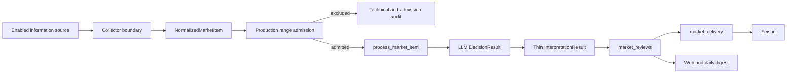

# MarketPulseWire Current Architecture

This document describes the current code and production structure. Engineering
rules live in `AGENTS.md`, active work lives in the local
`docs/monitoring-plan.md`, and operating procedures live in `docs/deployment.md`.

## Unified Information Flow

Every enabled source except the explicit X route produces a
`NormalizedMarketItem` and uses one downstream flow:

```text
collector
-> technical discovery dedup and enrichment
-> NormalizedMarketItem
-> five-group production range admission
-> process_market_item
-> decision_engine
-> market_interpreter
-> market_reviews
-> market_delivery
-> Web / daily digest / Feishu
```


```mermaid
flowchart LR
    Source["Enabled information source"] --> Collector["Collector boundary"]
    Collector --> Item["NormalizedMarketItem"]
    Item --> Admission["Production range admission"]
    Admission -->|excluded| Audit["Technical and admission audit"]
    Admission -->|admitted| Flow["process_market_item"]
    Flow --> Decision["LLM DecisionResult"]
    Decision --> Interpretation["Thin InterpretationResult"]
    Interpretation --> Review["market_reviews"]
    Review --> Delivery["market_delivery"]
    Review --> View["Web and daily digest"]
    Delivery --> Feishu["Feishu"]
```

`source_category`, `publisher_role` and `content_type` describe collection,
display and audit facts. They do not select a decision, review, storage or
delivery path, and they cannot create push eligibility. Terms
such as report, company feed, flash, announcement and policy release remain
source facts only; they are not separate information models.

Collectors own compliant fetching, technical identity, body/attachment
enrichment, normalization, source state and health. They do not write completed
reviews, reserve rule dedup or deliver individual items. `seen_items` is a
technical discovery and lifecycle ledger used by collectors that need a stable
pre-enrichment reservation; it is not a second review store.

Value-directory first discovery keeps the current list as a no-delivery
baseline. Each entry is normalized and passed to
`process_market_item(..., baseline_only=True)`, which stores it in
`market_items` without range admission, a review, decision, delivery or rule
dedup reservation. `seen_items` separately records the technical baseline and
links its `result_market_item_id`; the information center never reads
`seen_items` as a display source.

The production collector services group sources only for shared transport and
cadence:

| Service | Collector boundary |
| --- | --- |
| `surveil-research-collector` | RSS/RDF, bounded public list pages and AlphaAbstract public summaries |
| `surveil-official-collector` | Enabled company RSS feeds |
| `surveil-news-collector` | Enabled public media APIs/feeds and official trade-policy sources |
| `surveil-sina-flash` | Sina 7x24 long-running collection |
| `surveil-sina-stock-news` | Holding-related Sina stock-news discovery |
| `surveil-company-disclosures` | CNINFO public announcements and investor-relations records |
| `surveil-value-directory` | Private Playwright/OCR collection boundary |

The three grouped collectors have one production entry each. Their retired
shadow modes and the standalone overseas-media wrapper do not exist.

Source profile `frequency` and `proxy_profile` values are read-only runtime
facts defined by code. Actual cadence is owned by systemd or the long-running
process, and actual proxy behavior is owned by the private server environment
and transport layer; neither value is a Web-managed override.

## Admission And Decision

Production range admission is the logical OR of `holding`,
`semiconductor_ai`, `macro_data`, `fed_policy` and `trade_policy`. Source
boundaries may restrict which groups are allowed, such as holding-only company
disclosures and Sina stock news, but cannot assign an action. The private
`RULE_CORE_CONFIG` file and current Web-managed holdings are the production
truth. Missing or invalid configuration fails closed.

For every admitted item, `decision_engine.py` loads the reviewed private rules
from `LLM_DECISION_RULE_CONFIG` and makes one bounded LLM decision request. The
model must return every applicable rule, exact evidence references, allowed
actions and a consistent final action. Code validates the structure, evidence,
rule version and aggregation.

`DecisionResult.action` is the only push-eligibility authority. A model,
validation or private-audit failure leaves no valid `DecisionResult`,
interpretation, delivery or dedup reservation and marks the current review
`failed_retryable`. A structurally valid `uncertain` result caused by missing or
conflicting required facts becomes terminal `insufficient_evidence`; it is not
an action and is not retried automatically. A stored successful review without
a valid `DecisionResult` also fails closed and becomes `failed_retryable`.

After a valid decision, `market_interpreter.py` produces only a short
`core_content` summary. It cannot add, promote or reduce an action. Delivery
cards show `推送依据` from the persisted winning `DecisionResult` rule reasons,
not collector fields or interpretation text.

Delivery may prevent duplicates without changing the decision. Current
deduplication covers source identity plus the existing bounded cross-source
facts for market moves, US macro releases, industry facts, investment-bank
reports and company facts. These are delivery identities, not alternative
decision rules.

## Storage

`market_db.py` is the only production schema initializer. Business processes
open the initialized SQLite database but do not create or alter schema. Direct
upgrades from databases created by older revisions are not supported.

Current stores are:

- `market_items`: one `(source, source_item_id)` identity, normalized content,
  source metadata and technical lifecycle.
- `market_reviews`: range-admission audit and the current/versioned
  `DecisionResult` and `InterpretationResult`.
- `deliveries`: Feishu execution audit linked directly by `market_item_id` and
  `market_review_id`; it records outcomes and never creates eligibility.
- `market_feedback`: append-only feedback events linked directly to
  `market_item_id`.
- `seen_items`, `seen_posts`, `seen_sources`,
  `trendforce_page_seen_items`: source-specific technical discovery state.
- `source_state`, `source_health`, `x_stream_health`: bounded runtime state and
  health.
- `rule_alert_dedup`: current delivery dedup reservations.
- `portfolio_holdings`, `stocks`, `stock_relations`: Web-managed portfolio and
  relationship data.

There is no alias table, no information-type identity mapping, no mirror trigger
from `seen_items`, and no old result table. Readers,
feedback and delivery use direct unified integer identities.

`market_canonical_reader.py` reads current unified columns only. The Web
`/api/market-items`, daily digest and feedback projections all use this reader.
The Web page is named `信息中心`; it does not route or filter through an item
kind. A source filter is a display condition only.

New reviews persist `DecisionResult.action` without the retired derived
`importance`, interpretation-switch or push-boolean fields. Existing Alibaba
SQLite rows and their extra JSON fields remain untouched for non-destructive
compatibility, but current runtime readers and writers ignore them. Physical
removal of an existing production column is a separate database operation.

## Feedback And Web

When `FEISHU_FEEDBACK_ENABLED=1`, the application bot sends the same unified
market-information card with signed `特别有用`, `重复` and `无效` actions. Each
callback appends one audit event and updates the same card. Feedback cannot
modify admission, decision, dedup, source profiles or settings. Test-card rows
use no production item identity and are excluded from quality metrics.

The authenticated workbench serves same-origin static assets and bounded API
projections. Its information-source and source-filter controls show enabled
profiles only. Current multi-select controls are presentation filters and do
not change collection or decision configuration.

Private LLM request/response audits are stored only in service-account-owned
mode-`0600` files under `reports/llm-decision-audits`. Sensitive request and
response content is removed after 30 days while bounded decision results remain.
When an approved empty-database rebuild intentionally discards the retired
database generation, its associated audits are retired and deleted with that
generation after the same verification window; only a private bounded deletion
manifest remains.
Full model input, source body and raw response never enter SQLite, Web, Git or
Feishu. The Web decision review associates a retained audit only when its
review, market item and source identities match the current SQLite row and the
audit was generated after that review was created. Reused integer IDs after an
empty-database rebuild therefore cannot attach an older audit to a current item.

## Explicit Independent Route

`x_stream.py` retains a dedicated long-lived X stream, REST backfill,
thread/media enrichment, `seen_posts` state and X-specific card delivery. These
stream and media semantics are not represented by the general collector
boundary. Regression coverage is in `test_x_stream_health.py`. This is the only
documented independent information route.

## Deployment Facts

- Production runs only on Alibaba Cloud Debian 12 under systemd.
- The server Web panel, private `.env`, private rule files, source-profile
  override and production SQLite are production configuration/data truths.
- Normal deployment preserves private configuration, data, reports, logs,
  browser profiles and private rules.
- A schema-breaking cleanup uses a separately approved empty-database rebuild;
  it is never hidden inside normal db-init or collector startup.
- CI calls `scripts/run_test_suite.py`, which classifies every `test_*.py`
  exactly once. Operator smoke tests with real external effects stay outside CI.
- Huawei Cloud is not a deployment target and must not be started or changed.
