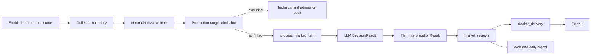

# MarketPulseWire Current Architecture

This document describes the current code and production structure. Engineering
rules live in `AGENTS.md`, active work lives in the local
`docs/monitoring-plan.md`, and operating procedures live in `docs/deployment.md`.

## Unified Information Flow

Every enabled source, including X / Serenity, produces a
`NormalizedMarketItem` and uses one downstream flow:

```text
collector
-> technical discovery dedup and enrichment
-> NormalizedMarketItem
-> five-group production range admission
-> process_market_item
-> decision_engine
-> market_interpreter
-> market_reviews
-> market_delivery
-> Web / daily digest / Feishu
```


```mermaid
flowchart LR
    Source["Enabled information source"] --> Collector["Collector boundary"]
    Collector --> Item["NormalizedMarketItem"]
    Item --> Admission["Production range admission"]
    Admission -->|excluded| Audit["Technical and admission audit"]
    Admission -->|admitted| Flow["process_market_item"]
    Flow --> Decision["LLM DecisionResult"]
    Decision --> Interpretation["Thin InterpretationResult"]
    Interpretation --> Review["market_reviews"]
    Review --> Delivery["market_delivery"]
    Review --> View["Web and daily digest"]
    Delivery --> Feishu["Feishu"]
```

`source_category`, `publisher_role` and `content_type` describe collection,
display and audit facts. They do not select a decision, review, storage or
delivery path, and they cannot create push eligibility. Terms
such as report, company feed, flash, announcement and policy release remain
source facts only; they are not separate information models.

Collectors own compliant fetching, technical identity, body/attachment
enrichment, normalization, source state and health. They do not write completed
reviews, reserve rule dedup or deliver individual items. `seen_items` is a
technical discovery and lifecycle ledger used by collectors that need a stable
pre-enrichment reservation; it is not a second review store.

Value-directory first discovery keeps the current list as a no-delivery
baseline. Each entry is normalized and passed to
`process_market_item(..., baseline_only=True)`, which stores it in
`market_items` without range admission, a review, decision, delivery or rule
dedup reservation. `seen_items` separately records the technical baseline and
links its `result_market_item_id`; the information center never reads
`seen_items` as a display source.

The production collector services group sources only for shared transport and
cadence:

| Service | Collector boundary |
| --- | --- |
| `surveil-research-collector` | RSS/RDF, bounded public list pages and AlphaAbstract public summaries |
| `surveil-official-collector` | Enabled company RSS feeds |
| `surveil-news-collector` | Enabled public media APIs/feeds and official trade-policy sources |
| `surveil-sina-flash` | Sina 7x24 long-running collection |
| `surveil-sina-stock-news` | Holding-related Sina stock-news discovery |
| `surveil-company-disclosures` | CNINFO public announcements and investor-relations records |
| `surveil-value-directory` | Private Playwright/OCR collection boundary |
| `surveil-x-browser-collector` | Private Chromium DOM collection of the logged-in X “正在关注” timeline |

The three grouped collectors have one production entry each. Their retired
shadow modes and the standalone overseas-media wrapper do not exist.

Source profile `frequency` and `proxy_profile` values are read-only runtime
facts defined by code. Actual cadence is owned by systemd or the long-running
process, and actual proxy behavior is owned by the private server environment
and transport layer; neither value is a Web-managed override.

## Admission And Decision

Production range admission is the logical OR of `holding`,
`semiconductor_ai`, `macro_data`, `fed_policy` and `trade_policy`. Source
boundaries may restrict which groups are allowed, such as holding-only company
disclosures and Sina stock news, but cannot assign an action. The private
`RULE_CORE_CONFIG` file and current Web-managed holdings are the production
truth. Missing or invalid configuration fails closed.

For every admitted item, `decision_engine.py` loads the reviewed private rules
from `LLM_DECISION_RULE_CONFIG` and makes one bounded LLM decision request. The
model must return exactly one action for every applicable rule. It evaluates
`push` before `daily`, returns `archive` when neither condition is met, and
provides exact minimum evidence references only for `push` or `daily`. Code
validates the structure, evidence, rule version and `push > daily > archive`
aggregation.

`llm_analysis.py` is the single model transport for DeepSeek, Zhipu GLM 5.3
Flash and existing OpenAI-compatible configurations. `LLM_PROVIDER=deepseek`
uses `LLM_API_KEY`, `LLM_BASE_URL` and `LLM_MODEL`;
`LLM_PROVIDER=zhipu_glm` uses the separate `LLM_GLM_API_KEY` and the code-fixed
official endpoint `https://open.bigmodel.cn/api/paas/v4` with
`glm-5.3-flash`. The Web workbench changes only this model selection and its
private connection values. It does not select a different decision, review,
storage, dedup or delivery path. A missing key for the selected model fails
closed instead of using the other model's key.

`DecisionResult.action` is the only push-eligibility authority. A model,
validation or private-audit failure leaves no valid `DecisionResult`,
interpretation, delivery or dedup reservation and marks the current review
`failed_retryable`. Missing or conflicting facts select `daily` or `archive`
under the reviewed rule text; the active decision path no longer produces
`uncertain` or a new `insufficient_evidence` review. Existing historical
`insufficient_evidence` rows remain readable without migration. A stored
successful review without a valid `DecisionResult` also fails closed and becomes
`failed_retryable`.

After a valid decision, `market_interpreter.py` produces only a short
`core_content` summary. It cannot add, promote or reduce an action. Delivery
cards show `推送依据` from the persisted winning `DecisionResult` rule reasons,
not collector fields or interpretation text.

Delivery may prevent duplicates without changing the decision. Current
deduplication covers source identity plus the existing bounded cross-source
facts for market moves, US macro releases, industry facts, investment-bank
reports and company facts. These are delivery identities, not alternative
decision rules.

## Storage

`market_db.py` is the only production schema initializer. Business processes
open the initialized SQLite database but do not create or alter schema. Direct
upgrades from databases created by older revisions are not supported.

Current stores are:

- `market_items`: one `(source, source_item_id)` identity, normalized content,
  source metadata and technical lifecycle.
- `market_reviews`: range-admission audit and the current/versioned
  `DecisionResult` and `InterpretationResult`.
- `deliveries`: Feishu execution audit linked directly by `market_item_id` and
  `market_review_id`; it records outcomes and never creates eligibility.
- `market_feedback`: append-only feedback events linked directly to
  `market_item_id`.
- `seen_items`, `seen_posts`, `seen_sources`,
  `trendforce_page_seen_items`: source-specific technical discovery state.
- `source_state`, `source_health`: bounded runtime state and health. The
  historical `x_stream_health` table remains for non-destructive compatibility;
  the browser collector uses `source_health` with monitor `x_browser`.
- `rule_alert_dedup`: current delivery dedup reservations.
- `portfolio_holdings`, `stocks`: Web-managed portfolio data.

There is no alias table, no information-type identity mapping, no mirror trigger
from `seen_items`, and no old result table. Readers,
feedback and delivery use direct unified integer identities.

`market_canonical_reader.py` reads current unified columns only. The Web
`/api/market-items`, daily digest and feedback projections all use this reader.
The Web page is named `信息中心`; it does not route or filter through an item
kind. A source filter is a display condition only.

New reviews persist `DecisionResult.action` without the retired derived
`importance`, interpretation-switch or push-boolean fields. Existing production
SQLite rows and their extra JSON fields remain untouched for non-destructive
compatibility, but current runtime readers and writers ignore them. Physical
removal of an existing production column is a separate database operation.

## Feedback And Web

When `FEISHU_FEEDBACK_ENABLED=1`, the application bot sends the same unified
market-information card with signed `特别有用`, `重复` and `无效` actions. Each
callback appends one audit event and updates the same card. Feedback cannot
modify admission, decision, dedup, source profiles or settings. Test-card rows
use no production item identity and are excluded from quality metrics.

The authenticated workbench serves same-origin static assets and bounded API
projections. Its information-source and source-filter controls show enabled
profiles only. Current multi-select controls are presentation filters and do
not change collection or decision configuration.

Private LLM request/response audits are stored only in service-account-owned
mode-`0600` files under `reports/llm-decision-audits`. Sensitive request and
response content is removed after 30 days while bounded decision results remain.
When an approved empty-database rebuild intentionally discards the retired
database generation, its associated audits are retired and deleted with that
generation after the same verification window; only a private bounded deletion
manifest remains.
Full model input, source body and raw response never enter SQLite, Web, Git or
Feishu. The Web decision review associates a retained audit only when its
review, market item and source identities match the current SQLite row and the
audit was generated after that review was created. Reused integer IDs after an
empty-database rebuild therefore cannot attach an older audit to a current item.

## X Browser Boundary

`x_browser_monitor.py` is a scheduled browser collector, not a second decision
or delivery path. It launches the private Chromium profile, reads only the
visible “正在关注” timeline DOM, filters promoted/reposted cards, applies a
bounded scroll and timeout, and normalizes each usable tweet. The first
successful run establishes a no-delivery baseline through
`process_market_item(..., baseline_only=True)`; later new identities use the
same production admission, LLM `DecisionResult`, review and delivery flow as
every other source. Login is performed manually on the JD Cloud host through
`scripts/open_x_browser_login.sh`, which starts Chromium directly on a temporary
Xvfb display rather than controlling the login window through Playwright. The
production browser installer provides Debian system Chromium as the shared
runtime while ValueList and X retain separate private profiles. Cookies and
browser state never enter Git, SQLite, reports or deployment artifacts.

The older `x_stream.py`, `x_check.py` and related API smoke helpers remain only
as uninvoked compatibility code for historical tests. They are not registered
in the source catalog or systemd and must not be enabled in production.

## Deployment Facts

- Production runs only on JD Cloud Debian 12 under systemd. The shared host may
  run other projects, but MarketPulseWire retains its own `surveil` service
  account, `/opt/surveil`, `/opt/surveil-proxy`, virtual environment, private
  state, logs and `surveil-*` units.
- The server Web panel, private `.env`, private rule files, source-profile
  override and production SQLite are production configuration/data truths.
- Normal deployment preserves private configuration, data, reports, logs,
  browser profiles and private rules.
- A schema-breaking cleanup uses a separately approved empty-database rebuild;
  it is never hidden inside normal db-init or collector startup.
- CI calls `scripts/run_test_suite.py`, which classifies every `test_*.py`
  exactly once. Operator smoke tests with real external effects stay outside CI.
- Alibaba Cloud and Huawei Cloud are not active deployment targets and must not
  be started or changed during ordinary production operation.
