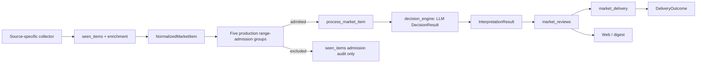

# MarketPulseWire Current Architecture

This document is an as-built map of the current code and production shape. Engineering rules live in `AGENTS.md`; active work lives in the local `docs/monitoring-plan.md`; deployment operations live in `docs/deployment.md`.

## Runtime Spine

All general research, industry-media, news-media, official-company, official trade-policy, flash, portfolio-news, company-disclosure, AlphaAbstract, and ValueList items use one runtime entry:

```text
collector
-> seen_items discovery/dedup reservation (article/flash sources)
-> detail/RSS body/summary/PDF/OCR enrichment and technical validity
-> NormalizedMarketItem
-> five production range-admission groups
-> process_market_item
-> decision_engine
-> market_interpreter
-> review store adapter
-> market_delivery
-> Web / digest / Feishu
```


```mermaid
flowchart LR
    Source["Source-specific collector"] --> Enrichment["seen_items + enrichment"]
    Enrichment --> Item["NormalizedMarketItem"]
    Item --> Admission["Five production range-admission groups"]
    Admission -->|admitted| Runtime["process_market_item"]
    Admission -->|excluded| Seen["seen_items admission audit only"]
    Runtime --> Decision["decision_engine: LLM DecisionResult"]
    Decision --> Interpretation["InterpretationResult"]
    Interpretation --> Store["market_reviews"]
    Store --> Delivery["market_delivery"]
    Store --> View["Web / digest"]
    Delivery --> Outcome["DeliveryOutcome"]
```

`DecisionResult.action` is the only push-eligibility input accepted by delivery. Delivery execution may still produce `sent`, `duplicate`, `skipped`, or `failed`. Missing decisions cannot fall back to legacy push fields. For a push-eligible intraday Chinese equity market move, delivery may derive a conservative source-neutral fact identity from the Beijing market date, direction, literal concept, and an already matched holding/keyword target; the first reservation sends and later matching source retransmissions are recorded as duplicates without changing the decision.

After a valid `DecisionResult` exists, `market_interpreter` generates only `core_content`: a one-to-two-sentence summary of the decision-relevant facts. It does not generate a push reason, risk commentary, related targets or a second action judgement. Unified Feishu article, official-news and event cards render `核心内容` from this interpretation and render `推送依据` as a read-only projection of the persisted final `DecisionResult`: only rule-hit reasons whose `decision_action` equals the final action are shown, in rule order, with at most four distinct reasons and a bounded omitted-count line. For legacy decisions without rule-hit reasons, the final decision reason is the fallback. Collector `push_reason`, interpretation text and compatibility push fields cannot contribute to `推送依据`. These cards do not render interpretation risks or related-target sections; historical Web readers may still project fields stored by older interpreter versions.

The production range admission is the logical OR of `holding`,
`semiconductor_ai`, `macro_data`, `fed_policy`, and `trade_policy`. Ordinary
article, research, official-company and Sina 7x24 items may enter through any
group. Company disclosures and Sina stock news are holding-only sources.
Official trade-policy profiles receive direct `trade_policy` admission after
normalization. An excluded article/flash remains in `seen_items` with the exact
`AdmissionResult` audit and creates no decision, interpretation, review, dedup
reservation or delivery. Baseline rows remain non-deliverable and are not
reprocessed because of this switch.

Within `semiconductor_ai`, the private `semiconductor_ai_keywords` list remains
the master list. Its private `semiconductor_ai_title_keywords` subset matches
only the normalized title; every other master-list term keeps full normalized
text matching. This changes no relationship between the five admission groups:
a holding or related-keyword match remains independently sufficient. Within
`macro_data`, `indicators` is the single core-indicator list; there is no
primary/secondary tier or secondary-indicator reaction fallback.

Production admission reads the complete private rule file selected by
`RULE_CORE_CONFIG` and current enabled holdings, aliases, related-news keywords
and exclusions from the Web-managed production SQLite. `RULE_CORE_SHADOW_PORTFOLIO`
is not a production input. Missing or invalid production rule configuration
fails closed and leaves a retryable processing state; it does not fall back to
the preceding source-specific admission.

Before an admitted item that requires analysis enters the active decision, `market_flow.py` calls `prepare_item_for_decision()` at most once. The returned `NormalizedMarketItem`, including any validated `_attributed_research` extraction, is passed with the exact production `AdmissionResult` and current production portfolio to `decision_engine.py`. The engine loads the reviewed LLM degree rules from the private mode-`0600` file selected by `LLM_DECISION_RULE_CONFIG`, calls them once under one 120-second total deadline, validates the complete result, writes the mode-`0600` private audit and returns the only production `DecisionResult`. A private rule may declare more than one applicable range-admission group; it is selected only when those declared groups intersect the item's already matched and source-allowed groups. This selection cannot add a range-admission group or bypass a source boundary. Missing or invalid private decision rules fail closed. The LLM HTTP client uses the configured provider endpoint directly and does not inherit collector `HTTP_PROXY`, `HTTPS_PROXY` or `ALL_PROXY` variables; those proxies remain scoped to source fetching. Baseline, excluded, unanalysed and already-succeeded rows do not call the model. Model, validation or audit-write failure leaves no decision, interpretation, delivery or dedup reservation and marks the current review `failed_retryable`. A structurally and evidentially valid no-match-plus-`uncertain` result instead marks the review and item `insufficient_evidence`; this terminal evidence-insufficiency status creates no `DecisionResult` and is not selected for another automatic evaluation.

The private degree-rule catalog gives `holding` and `semiconductor_ai` one
shared seven-rule set. Their range admission remains independent, and the
matched family evidence remains in every decision audit. Company disclosures
and Sina stock news remain holding-only sources, but after a valid holding
admission they use the same seven rules as every other holding- or
semiconductor/AI-admitted item. A multi-group item selects each shared rule only
once. Retired rule IDs remain only in bounded delivery-dedup compatibility sets
for already stored decisions; they are not active rules or fallback decisions.

Push-eligible US CPI, PCE and nonfarm coverage may also receive a delivery-only identity from locally bound evidence. Preview and actual-release identities use country, indicator and reference period. The extractor considers every indicator occurrence in a claim before binding the nearest preceding reference month, so an early generic `CPI` label cannot hide a later locally complete `6月...CPI月率` fact. Market reactions use the same reference period, conservatively inferring the immediately preceding month when a reaction names the indicator but omits the period, so cross-asset and next-day retellings converge. Each phase can deliver once across sources. Corrections, policy decisions, quantified path repricing, unusual inverse relationships, asset-specific hard facts and direct Kevin Warsh statements bypass the reaction identity, including when a retained fact is mixed with already-covered market interpretation. Other cross-asset reactions to a Fed easing or tightening impulse without a named data release share one direction-specific 14-day delivery identity. The extractors use original item text and deterministic evidence only; delivery dedup does not change the decision or use an LLM.

Push-eligible industry-hardline coverage may receive a bounded 36-hour delivery-only fact identity when original text deterministically supplies subject, event, stage, object and direction. The initial event families cover IBM enterprise spending shifting toward memory hardware and CoreWeave exploring derivatives to hedge storage-chip price downside. Cross-source rewrites remain push decisions but are recorded as duplicates. Corrections, company confirmation or denial, execution-stage changes, material derivative terms and independently attributable HBM/DRAM/NAND supplier production facts bypass the prior identity.

Push-eligible holding or industry-hardline coverage may also receive source-neutral company-event delivery identities. Claim-local stock codes, direct holding entities and validated company-name/action grammar resolve explicit subjects without an issuer allowlist. Common company actions use strict structured slots, while the conservative generic path requires an explicit subject, action family, reference/effective time and distinctive counterparty, object or quantitative anchor. Each item may produce a fact set rather than one selected key. The delivery layer reserves every new identity in one immediate SQLite transaction, suppresses only when the entire set is already covered, confirms all reservations after send success and releases all after failure. Stable event identity is separated from lifecycle/material version so equivalent or subset restatements deduplicate while explicit corrections, revisions, approvals, completions and terminations remain deliverable. The predecessor's five bounded keys remain only as migration aliases. These execution records preserve the original `DecisionResult.action=push`.

The former direct/compat route switch and these wrapper modules have been removed:

- `article_gate.py`
- `official_news_gate.py`
- `content_runtime.py`
- `event_runtime.py`
- `market_content_flow.py`
- `market_event_flow.py`
- `event_pipeline.py`

## Module Ownership

| Module | Current responsibility |
|---|---|
| `market_flow.py` | Normalization boundary and the single `process_market_item` owner: one-time pre-decision evidence preparation, production LLM decision through `decision_engine`, interpretation, unified storage, delivery and fail-closed handling |
| `market_content_adapter.py` | Article and official-news display/delivery payload projection from an existing authoritative `MarketFlowResult`; it cannot call the decision or interpretation flow |
| `market_event_adapter.py` | Event normalization, display/delivery payload projection and event delivery from an existing authoritative `MarketFlowResult`; it cannot call the decision or interpretation flow |
| `decision_engine.py` | Single production decision boundary. It delegates admitted items to the reviewed LLM decision and returns the only authoritative `DecisionResult`; no deterministic action implementation or fallback remains |
| `production_admission.py` | Sole production entry for the five range-admission groups; validates `RULE_CORE_CONFIG`, converts current Web-managed SQLite holdings to `PortfolioRuleConfig`, applies ordinary/holding-only/official-trade source boundaries and returns the auditable `AdmissionResult`; it cannot decide action, write reviews or deliver |
| `admission_rules.py` | Side-effect-free five-group range-admission implementation. It returns bounded `AdmissionResult` evidence and cannot assign action, write reviews or deliver |
| `llm_rule_catalog.py` | Strict loader and schema validator for the gitignored private LLM decision-rule JSON selected by `LLM_DECISION_RULE_CONFIG`; accepts legacy single-group v1 and current multi-group v2 files, exports validated rules to the prompt builder and fails closed when the file is missing or invalid |
| `llm_rule_decision.py` | LLM decision contract: selects only the rules applicable to an existing admitted `AdmissionResult`, accepts title/summary/body with body code-bounded to 3,000 characters, divides model-visible text into numbered segments, and strictly validates per-rule JSON, allowed actions and exact evidence before mechanically aggregating the final action |
| `llm_rule_execution.py` | Side-effect-free LLM rule execution below the production wrapper. It builds one prompt, performs strict validation and permits one correction request containing only the original response and validation errors |
| `llm_production_decision.py` | Production deadline and private-audit wrapper. It enforces one 120-second total budget across retries and correction, writes one mode-`0600` audit linked by market item/review ids, and fails closed when no valid audited decision exists |
| `llm_decision_audit_cleanup.py` | Daily 30-day retention cleanup for private production LLM decision audits; removes expired request/response content while retaining bounded decision results |
| `run_production_collector.py` | Shared production service entry wrapper that runs the selected research, official-company or domestic-news collector once |
| `macro_policy.py` | Macro-data/Fed range and source-discovery evidence classification; it cannot assign or modify action |
| `trade_friction.py` | Source-neutral China-US / China-EU trade-friction classification and evidence extraction |
| `trade_policy_monitor.py` | Official API/RSS/list discovery, new-item detail enrichment, baseline and source health |
| `company_disclosures.py` | One logical portfolio-disclosure collector, provider selection, baseline, source state and health |
| `disclosure_providers.py` / `cninfo_disclosure_provider.py` | Provider-neutral disclosure contract and CNINFO public-query transport |
| `disclosure_document.py` | Shared bounded PDF download, SHA-256 and `pypdf` text extraction |
| `market_interpreter.py` | Decision-downstream generation and strict normalization of the single `core_content` field; it cannot generate reasons, risks, targets or action judgements |
| `market_content_adapter.py` | Article and official-news payload projection for cards and unified storage |
| `market_event_adapter.py` | Event payload projection for cards and unified storage |
| `market_store.py` | Current `market_items`, `market_reviews`, aliases and linked delivery persistence |
| `market_delivery.py` | Rule/fact dedup reservation and DecisionResult-based Feishu push execution; it writes only unified delivery audits |
| `market_feedback.py` | Cross-source append-only human feedback, signed item identity, per-operator multi-label toggle projection and quality aggregates |
| `llm_decision_web.py` | Read-only Web projection of current SQLite `DecisionResult` plus bounded private-audit attempt summaries; it cannot create, change or restore an action |
| `feishu_app.py` / `feishu_feedback_service.py` | Feedback-enabled application-bot send and official long-connection card callbacks |
| `macro_event_dedup.py` | Delivery-only US macro preview/release/reaction and Fed policy cross-asset reaction identities, including mixed-Warsh handling |
| `industry_fact_dedup.py` | Bounded delivery-only industry fact identities and material-update exclusions |
| `investment_bank_report_dedup.py` | Delivery-only, source-neutral individual-equity investment-bank report identities derived from validated winning-rule evidence |
| `company_event_dedup.py` | Generic claim-local company-event fact sets, lifecycle versions and legacy reservation aliases |
| `source_profiles.py` | Source catalog, runtime ownership, health keys and editable source settings; Web-managed private overrides are atomically replaced as mode `0600` |
| `rule_config_schema.py` | Side-effect-free parser for the production five-group range-admission configuration and Web configuration path |
| `media_keyword_config.py` | Shared loader and atomic Web save path for the private rule configuration's `semiconductor_ai_keywords`, title-only subset and `exclude_keywords`; validates the complete rule file and preserves every unrelated rule section |

## Production Sources

| Source group | Production entry | Item processing |
|---|---|---|
| Research and industry media | `research_collector.py` -> `rss_monitor.py` / `trendforce_page_monitor.py` / `alphabstract_monitor.py` | Unified runtime and unified storage with an `article` alias |
| Official company feeds | `official_collector.py` -> `rss_monitor.py` | Unified runtime and unified storage with an `official` alias |
| Domestic and overseas news media | `news_collector.py` -> `china_finance_media_monitor.py` / `wallstreetcn_monitor.py` / RSS helpers | Sina, Yicai, CLS, Jin10 and WallstreetCN public article/flash discovery; unified runtime and unified storage with an `article` alias |
| Official trade policy | `news_collector.py` -> `trade_policy_monitor.py` | Federal Register, USTR, European Commission and MOFCOM public sources; reserve `seen_items` before optional detail enrichment, then unified runtime and storage |
| Sina 7x24 flash | `sina_flash.py` | Reserve every discovered flash in `seen_items`; five-group-admitted flashes continue through the unified runtime with an `event` alias |
| Sina portfolio stock news | `sina_stock_news.py` | Relevance enrichment, then unified runtime with an `event` alias. Rediscovery skips succeeded reviews but re-enters the same `failed_retryable` review with the complete `market_items` content; one repeated failure does not abort the remaining holdings batch |
| Company disclosures | `company_disclosures.py` -> `cninfo_disclosure_provider.py` | Twice daily CNINFO fulltext/relation discovery and official-PDF enrichment; each provider's first successful fetch writes baseline event audits, and later new records enter normal analysis and delivery |
| AlphaAbstract research summaries | `alphabstract_monitor.py` through `research_collector.py` | Public sitemap discovery reserves `seen_items` identity before public-summary page enrichment, then unified runtime and storage |
| ValueList research directory | `value_directory_monitor.py` | At 05:00 and 21:00 Beijing time, one private-browser session collects all enabled lists and only the previews needed for new, retryable or explicitly rechecked entries, then closes before OCR and unified runtime/storage processing |

Source-specific login, WAF, API, sitemap discovery, polling, browser profile, OCR and attachment behavior ends before the normalized runtime boundary.

Each ValueList timer run uses one persistent Chromium context for all enabled ValueList sources. It reads both list pages, compares their stable ids with existing lifecycle/review state, and collects visible first-page preview metadata only for new entries, `pending`/`failed_retryable` entries and an explicitly requested old entry. Completed-but-unpushed entries are not automatically reprocessed unless the existing private opt-in switch is enabled. The context closes once before OCR, normalization, five-group range admission, the LLM degree decision, storage and delivery. This selection is lifecycle and retry control, not a preliminary range-admission or degree-decision gate. A list failure remains attributed to that source while another successfully collected source may continue; a detail-preview failure remains attached to that item. A browser launch or shutdown failure stops post-browser processing for every source owned by that session, so no later phase can silently relaunch Chromium against the same private profile.

Domestic finance media reserve each technically identifiable live discovery in
`seen_items` before detail enrichment, then record processability and construct
one `NormalizedMarketItem`. The five production range-admission groups inspect
its title, summary, full text and structured symbols. Admitted items continue
through the existing decision/review/delivery path; excluded items retain only
their `seen_items` admission audit. Rediscovered items whose processability,
admission evaluation or processing remains `pending`/`failed_retryable` are
eligible for retry without deleting their discovery reservation.

The same lifecycle now covers the widened overseas/industry RSS, TrendForce
page and official-company RSS paths. Their source-specific discovery controls
(feed/page selection, URL/schema validation and access policy) remain before
the reservation, but the business media-focus filter no longer blocks
`seen_items`. Each source group records an `expanded_scope_baseline_at`
watermark in its source state; rows first exposed by that widened scope are
baseline-only and cannot be delivered retroactively. Later live rows reuse the
same processability, admission and processing states, including retryable
failures. AlphaAbstract uses the same ordering around its public-summary page.
These sources persist the same five-group `AdmissionResult` before the LLM
degree decision.

Official trade-policy sources also reserve their stable list identity in
`seen_items` before optional detail enrichment. A detail failure retains the
official list evidence and records the fallback. After normalization the official
trade-policy profile receives direct production `trade_policy` admission and
continues to the LLM degree decision.

Sina 7x24 uses `seen_items` for discovery identity, baseline, retry and production
admission audit. The first non-empty response after this ordering change is an
expanded-scope baseline and creates no event or delivery. Later rows are
normalized from the provider's complete flash text. The five production
range-admission groups are evaluated there: excluded rows remain in `seen_items`,
while admitted rows proceed to `market_items` / `market_reviews` with an `event`
alias in `market_item_aliases`. Existing historical Sina 7x24 event identities
remain available through their migrated aliases. Event Center suppresses the
matching `seen_items` projection whenever the unified event item exists, so one
flash is displayed once. A retry completes the same current unified review.

Synchronous HTTP connection pools are isolated per worker thread. A source retry or timeout-key change may close only that thread's client; concurrent collectors cannot close another thread's in-flight TLS connection or leave a stale network writer targeting a reused SQLite file descriptor.

Ordinary bounded collector/provider requests use the shared `http_utils` transport. This includes CNINFO's form-encoded JSON lookup and disclosure-list POSTs, whose provider adapter retains only its required headers, form shape, response validation and `CninfoError` contract. Direct `urllib.request` runtime use is closed by an architecture-invariant registry: current entries are bounded streaming/binary transfers, the X long-lived stream, provider-specialized LLM/Feishu behavior, explicitly tracked legacy request paths and standalone operator tools. The shared buffered response helper is not used for disclosure PDFs because their downloader enforces a byte ceiling while streaming to an atomic temporary file.

Company disclosures use the logical source `company_disclosures`. `transport_provider` remains raw audit metadata and cannot affect importance or action. The current fixed provider factory contains `cninfo_public`; a future provider implements the same security-resolution and paginated-list contract and is selected through the private source profile. CNINFO `orgId` mappings, provider baselines and provider-neutral known identities use the existing `source_state`. Fulltext announcements and `relation/category_dyhd_szdy` investor-relations records are queried separately, then normalized identically. A provider's first successful run enters the unified event runtime only as `baseline_only` audits with analysis and delivery disabled. Those rows remain visible behind Event Center's baseline filter but cannot create a decision, AI interpretation or notification. Later new records from that provider enter normal production admission, decision and delivery. Historical `ifind_notice` event rows remain readable compatibility data; the expired iFinD announcement timer is removed.

CLS telegraph collection preserves bounded official product metadata in the normalized raw audit: numeric `type`, the official bracketed product label, `share_img`/VIP status, and parsed `author_extends` stock names/codes. Article cards display these fields for an observation phase approved by the user. The metadata does not create range admission, importance or `DecisionResult.action`; the existing public `content` remains part of the model-visible decision text.

The private LLM `trade_friction_escalation` rule is not tied to the official source group. It is applicable to every admitted normalized current or future source. Explicit policy procedures, instruments, retaliation or worsening China-US / China-EU relations can produce `push`; weaker explicit tension can produce `daily`; routine administrative reviews and generic diplomacy do not receive an alert action.

The authenticated Web `媒体关键词` page and every existing media-focus consumer
read the same `semiconductor_ai_keywords`, `semiconductor_ai_title_keywords`
and `exclude_keywords` fields from the private rule file selected by
`RULE_CORE_CONFIG`. The first list is the master list; the second must be its
validated subset and limits those terms to title matches. The Web save path
changes only those three fields, preserves all other rule groups, writes
atomically with mode `0600` and creates a private backup. Retired code-default,
base and extra-include lists have no runtime precedence or fallback. Their old
private file is no longer a runtime or deployment input.

The `international_bank_fed_rate_path_revision` rule is also source-neutral. It requires local attributed evidence that an audited major international bank changed its expected Federal Reserve hike/cut direction, count, timing, cumulative basis points or terminal rate. Material revisions produce `push`; a concrete current forecast without a provable revision produces `daily`. WallstreetCN identity and category metadata cannot create eligibility. Same-report reposts use the existing `rule_alert_dedup` reservation, while a later genuine path revision remains eligible.

Attributed-research delivery identities normally use the validated institution, topic, event family and locally retained horizon. The feedback-confirmed SEMI 2026 equipment-sales forecast uses a bounded canonical report identity anchored by institution, equipment-sales subject, 2026 horizon and normalized USD 165.9 billion metric; Chinese and English rewrites converge while each rewrite carries its prior generic hash as a migration alias. Other SEMI reports continue using the generic attributed-research identity.

Individual-equity investment-bank reports use a separate delivery-only identity
after a valid `DecisionResult.action=push`. The identity uses exact winning-rule
evidence and, only for missing local identity details, the same delivered article
to bind one trusted institution, covered company and normalized target price.
Publisher, URL, article publication date, current share price and derived upside
do not participate. The identity has a seven-day lookback and applies only when
every winning `push` rule is an individual-equity rating/target rule. Explicit
rating/target revisions and recommendation changes bypass it. An item with
another independent winning `push` fact also bypasses it and remains deliverable.
Missing or ambiguous institution, company, target price or currency fails open.
The identity can suppress delivery through the existing `rule_alert_dedup`
reservation lifecycle but cannot alter the original `DecisionResult.action`.

The ordered `investment_bank_rating_target_direct_holding` rule requires one local evidence window to bind a recognized institution, one directly mentioned holding and an actual rating, target-price or coverage action. An attached collector symbol, a generic earnings-estimate revision or institution/holding/action terms scattered across a multi-company article cannot create this rule hit. Bounded adjacent-sentence attribution is accepted only when the second sentence explicitly continues with `该行` / `其` / `the bank` or an equivalent report reference.

The exact LLM decision-rule titles, action conditions, required facts and
exclusions live only in the private rule file. Git tracks their schema, strict
loader, prompt contract and synthetic fixed-response tests, not production rule
content. The Mac development copy and Alibaba production copy must have the same
version and SHA-256 digest before a production restart.

For a Value Directory first-page preview, the existing bounded extraction exposes
the structured fields required by the private rules without exposing the full OCR
page to the degree-decision model.

Within the production `fed_policy` group, content with configured Federal
Reserve policy terms uses ordinary range admission. The existing trusted-bank
leader classifier is only a narrow supplementary admission path for locally
attributed cross-asset content that would otherwise miss those terms. Its
leader and multiple-signal checks can admit an item but cannot create an action;
the selected private LLM rules remain the only degree decision. Identifiable
institution reports that contain configured Federal Reserve policy terms do not
need this supplementary path.

The production private semiconductor/AI LLM decision rules are source-neutral.
Their model findings require exact local evidence and pass the same strict
action/evidence validation as every other rule. No deterministic AI credit or
compute action implementation remains.

## Storage

New production items also use the canonical storage contract:

- `market_items` owns one `(source, source_item_id)` identity, collected title,
  summary and available full text, source metadata, baseline/live class and the
  technical processing lifecycle. `seen_items` inserts and lifecycle updates
  are projected into this table before normalization; the normalized item then
  fills the richer content and metadata on the same row.
- `market_reviews` stores a versioned production `AdmissionResult` for every
  normalized live item. An excluded row has no `DecisionResult` or
  `InterpretationResult`. An admitted row is completed with the exact results
  returned by the unified runtime before delivery. It also retains the bounded
  compatibility payload needed to reproduce existing Web, digest and feedback
  views; private production LLM requests/responses remain outside
  SQLite.
- `market_item_aliases` maps the unified item identity to stable
  `article`, `official` and `event` source identities. Feishu feedback tokens
  and Web links therefore retain stable external identities.
- `deliveries` remains an execution audit, independent from decision
  authority. `market_item_id`, nullable `market_review_id`, `decision_action`
  and `attempted_at` link article, official-news and event delivery outcomes to
  the same item/review contract. Historical deliveries whose originating
  review could not be proven keep a null `market_review_id`.

Historical `legacy_store_kind`, `legacy_store_id` and `market_item_aliases`
values remain as provenance and stable external identity metadata; they do not
imply that a separate physical result table still exists. Missing body text,
admission evidence and review links remain missing instead of being inferred.

Web Event Center, article/official daily output and feedback lookup/quality
metrics read the unified tables through `market_canonical_reader.py`. When an
item has multiple current task results, display readers use the latest result
while all versions remain stored. Existing external ids are resolved through `market_item_aliases`;
historical deliveries without a provable originating review link only to the
item. New production processing reads and writes only unified result storage.

For newly admitted production items, `market_reviews` is also the processed /
retry/current-result authority. `market_flow.py` reuses a completed current
result directly; a retryable result is completed in place, while an explicit
reprocess creates a new current result version. A retryable result is reused
only when its stored `AdmissionResult` exactly matches the current one; changed
admission evidence or configuration creates a new current result and preserves
the prior version for audit. Decision and interpretation are written only to
`market_reviews`; external article/official/event identities are written to
`market_item_aliases` with `legacy_store_kind=market_items`. `deliveries`
determines whether the item was already sent and records the unified item/result
links at insertion. Feedback, Web overview, daily output, collector
reviewed-state checks and operational tools do not recover processing or
delivery state from old rows.

The project keeps these current physical stores:

- `market_items`, `market_reviews`, `market_item_aliases`
- `seen_items`, `seen_posts`, `source_state`
- `rule_alert_dedup`, `deliveries` (`rule_alert_dedup` also records delivery-only intraday market-move, US macro event, bounded industry-fact, individual-equity investment-bank report and generic company-event fact-set reservations)
- `market_feedback` (append-only Feishu feedback events; the latest valid operator/item event carries that operator's complete current label set)
- `source_health`, `x_stream_health`
- `portfolio_holdings`, `stocks`, `stock_relations`

The unused relation-suggestion workflow, retired rule-center audit store and
Web evidence retrieval stores are not part of the current schema or runtime.

`article`, `official` and `event` are external display/feedback identities, not
separate storage or decision paths. All three arrive through the unified runtime
above and resolve through `market_item_aliases`. The former article, official
news, event and event-analysis result tables have been retired after explicit
mapping verification and a production backup. Supported rollback begins with a
revision that already uses unified storage and does not require those tables.

`seen_items` keeps discovery identity as its primary responsibility. Additive
compatibility columns record `collection_class`, processability, admission and
processing status for newly collected domestic finance-media, RSS, TrendForce,
AlphaAbstract, ValueList, official trade-policy and Sina 7x24 items. Admission
audit fields retain matched groups, bounded evidence, configuration version,
rule-contract version and evaluation time; Sina 7x24 may additionally retain the
resulting event id. Existing rows are migrated as `legacy_unclassified`; no
historical baseline/exclusion/failure state is inferred, except that existing
Sina 7x24 event identities are explicitly projected as already admitted legacy
events. `DecisionResult.action` and delivery status are not copied into this
ledger and remain authoritative in the existing review/delivery paths.

AlphaAbstract reads its public sitemap into bounded discovery records containing
the stable summary URL identity and sitemap timestamp, then reserves those
records in `seen_items` before requesting the public summary page. The first
non-empty sitemap response after this ordering change records a per-source
`expanded_scope_baseline_at` boundary; already-visible rows are baseline and do
not enter enrichment, decision, review or delivery. Later live rows fetch and
parse the public summary page, update only the bounded title/summary/date fields
in `seen_items`, form `NormalizedMarketItem`, and enter the shared runtime. The
article body remains outside `seen_items`. Detail/parse failures and downstream
processing failures remain retryable when the same sitemap identity is observed
again; completed and baseline rows are not retried. The research collector's
read-only report path may still perform complete public-page enrichment without
writing discovery or lifecycle state.

`push_now`, `should_push_now` and `should_push` remain compatibility columns for historical readers and old rows. New delivery code does not read them as action inputs. `pushed_at` and delivery rows record what happened, not what should be sent.

When Feishu market feedback is explicitly enabled, unified article, official-news and event cards are sent by the configured enterprise application bot and carry signed `特别有用` / `重复` / `无效` actions. The delivery audit retains the feedback-card base payload for cards sent after this feature is enabled. After a valid action, the official long-connection callback appends only to `market_feedback`; the new row records the clicked label and the complete selected-label set after independently toggling that label. It returns a replacement of the same Feishu card with `反馈状态` and a `✓` on every selected label. Removing the last label leaves an empty current set without deleting history. Existing rows without a selected-label set retain their original single-label or `cleared` meaning. It cannot modify decisions, delivery reservations, source settings or rule settings. Card reconstruction uses the current review payload and falls back to the corresponding sent delivery payload, which is the canonical location for event-card bases. If neither contains a base card, the durable feedback remains and the callback explicitly warns that card state was not updated. `FEISHU_FEEDBACK_LISTENER_ENABLED` may start that listener for an isolated test card while leaving natural unified delivery on the pre-existing custom webhook. Test-card rows and empty current selections are excluded from quality denominators and Event Center feedback projection. Current feedback is selected by Feishu action time, then insertion id, so delayed callbacks cannot overwrite or cancel a newer choice. The Web workbench exposes feedback coverage and observed labelled-card outcomes by source, primary rule, all rule associations and source-by-primary-rule. One item is labelled once when it has at least one active label; each label count is independent, so label rates may sum above 100 percent. Its Event Center also reads the same current projection through `item_kind + source + item_id`, showing feedback on the three active store adapters and filtering inside each store query before limits. This projection is read-only, excludes test cards and operator identities, and distinguishes delivered-but-unlabelled, not-delivered and unsupported-route rows.

The Web workbench exposes a lightweight authenticated `/api/health/summary` projection for separate Task Health and Information Sources badges. One batched read-only `systemctl show` call pairs each production timer with its execution service; `task_failures` counts current logical-task failures, while `source_failures` counts only failing enabled profiles that are visible in the Information Sources view. Disabled source profiles do not contribute. The browser refreshes this summary only while visible. The full Task Health view retains detailed systemd rows, raw source-health/X connection diagnostics and bounded log tails even when a raw diagnostic does not map to a source-profile badge count.

The reviewed LLM degree rules are the only production action decision. There is
no runtime selector, second action implementation or fallback. A
non-empty title is sufficient input; available summary is included and available
body is code-truncated to its first 3,000 characters. The exact model-visible
fields are split into numbered source segments of at most 300 characters. The
model returns segment ids, every applicable rule exactly once, and only actions
defined by that rule. Code resolves the ids to exact source text, validates the
complete response and mechanically aggregates `push > daily > archive`. All
`not_matched` returns `archive`; no match plus any valid `uncertain` produces no
`DecisionResult` and ends as `insufficient_evidence` without automatic retry.
One invalid first response may receive one
correction request without changing rules, article input or admission. The
initial call, provider retries and correction share one hard 120-second budget.

Each production call writes its exact prompt, response, response metadata and
validation details to one service-account-private audit file under
`reports/llm-decision-audits`, with directory mode `0700` and file mode `0600`.
The file links directly to `market_item_id` and `market_review_id`; full prompts,
article body and raw response do not enter SQLite, Web, Git or Feishu. The
`surveil-llm-decision-audit-cleanup.timer` removes sensitive request/response
content after 30 days while retaining bounded result metadata.

The authenticated Web `/api/llm-decisions` view reads final action, article
metadata and valid `DecisionResult` rule hits from unified SQLite. Failed model
attempts are joined by `market_review_id` to the private audit file's bounded
`web_projection`, which contains only status, bounded reasons, rule judgments,
bounded evidence/counterevidence and version metadata. The endpoint never reads
or returns complete model requests, article bodies or raw model responses. An
`uncertain` attempt is shown as terminal `证据不足` with no `DecisionResult`,
never as a push-eligible action. The projection remains in the same private
audit file after sensitive request/response cleanup; it is not a second store or
decision authority.

The same `holdings_web.py` process serves the workbench shell and its same-origin assets. `web/index.html` owns the document structure, `web/styles.css` owns presentation and `web/app.js` owns browser rendering and `/api/*` calls. The Python handler substitutes only the environment/token-hint placeholders and exposes an explicit `/static/styles.css` and `/static/app.js` allowlist; it is not a generic file server. API routes, authentication behavior, loopback binding and SSH-tunnel access remain unchanged.

Holdings preview always applies whole-list local structure validation, but market-name lookup runs only for a new, newly enabled or changed symbol/name/alias identity. Keyword and business-description edits do not revalidate unchanged identities. Preview returns a short-lived process-local signed token bound to the normalized payload and current portfolio revision. Save verifies that token and revision inside the existing file lock, then performs the atomic private-JSON write and SQLite import without external network I/O. An already-current identical payload returns an idempotent no-change result without another backup or import only when the SQLite portfolio projection also matches; a partial prior JSON-write/SQLite-import failure repairs only the SQLite projection. The browser exposes validating/saving/refreshing states and prevents concurrent holdings submissions; bounded request logs retain only request id, duration, digest prefix, remote-check count and outcome.

## Independent Routes

### X / Serenity

`x_stream.py` keeps its dedicated stream, thread/media enrichment, `seen_posts` state and X card delivery. The general article/event stores do not currently represent those semantics cleanly. Regression coverage lives in `test_x_stream_health.py`.

Review condition: reconsider convergence when X posts can be represented without losing thread/media rendering or stream retry state.

## Runtime And Deployment Facts

- Production runs on an Alibaba Cloud Debian 12 server under systemd; collector timers and persistent services are listed in `docs/deployment.md`.
- The server Web panel and private server `.env` are the production configuration truth.
- Private `.env`, portfolio data, SQLite, browser profiles, cookies and local source overrides are excluded from Git and deployment replacement.
- X/Serenity and ValueList access stay within the API/account-visible boundary; the project does not bypass subscriptions, paywalls, WAF or authentication controls.
- CI compiles scripts, checks shell syntax, scans secrets and invokes `scripts/run_test_suite.py`, the same canonical CI-safe regression manifest used by `Justfile`. Every `scripts/test_*.py` is classified exactly once. The three Feishu/X operator smoke scripts remain outside ordinary CI because they load private configuration and send messages, fetch live X content or upload media. Manifest drift fails closed before tests run, and `test_architecture_invariants.py` remains part of the required suite to prevent the unified spine from drifting.
